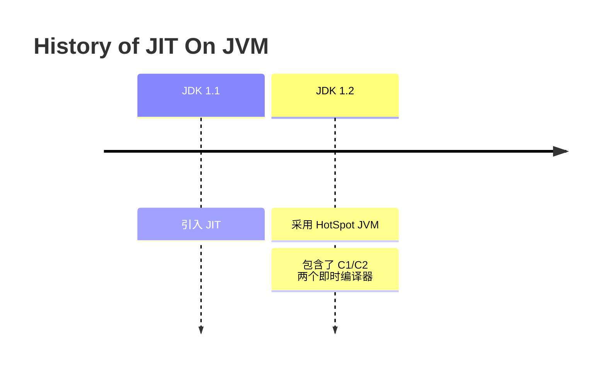
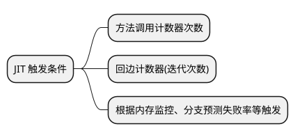
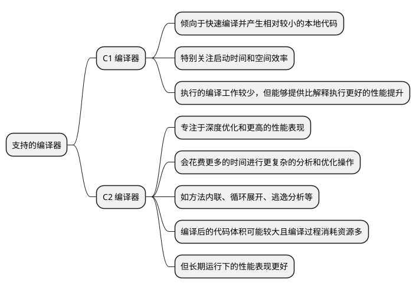

# JIT

当 Java 的代码编译成字节码，字节码加载到 JVM 后，部分代码将会采用解释执行，对于热点代码会采用即时编译(Just-In-Time Compilation, JIT)。
这篇文档详细描述了JVM如何识别热点代码、采用何种策略进行分层编译优化，以及如何通过栈上替换（On-Stack Replacement, OSR）和退优化
（Deoptimization）等手段确保程序在获得更高性能的同时保持良好的适应性和稳定性。

## 为什么引入 JIT {id="why"}

在 Java 早期，代码被编译为字节码，然后在 JVM 中通过解释执行字节码。但是，纯解释执行效率相对比较低，尤其是对哪些频繁执行的热点代码。所以在
1997 年发布的 JDK 1.1 版本中引入了 JIT 编译器，以提升代码的执行性能。但是，这个版本的 JIT 基础比较基础，主要了为加速热点代码的执行。

在 JDK 1.2 版本中使用 HotSpot JVM 作为默认的 Java 虚拟机的实现。采用了更先进的 JIT 编译技术，包括分层编译、动态编译和自适应优化等技术。

这个时候，当中包含了两个主要的即时编译器，C1 (Client Compiler) 和 C2 (Server Compiler), C1 是针对客户端应用的，而 C2 是针对服务端应用的。 

随着多核技术的发展，JIT 也随之发展。增加了更多的优化手段，比如内联函数、循环展开、逃逸分析等。

因为 JIT 可以在运行时编译，所以相对于静态编译来说可以获得程序运行时的信息。针对运行时的代码优化，其峰值表现可能相对于 C++ 等静态编译的语言更高。

## 即时编译的触发条件 {id="when"}

之前，我们写过一个 `Hello Wolrd` 的程序，它并不会触发即时编译。因为一行 `Hello World` 的打印很快就会执行完成，采用解释执行即可。只有热点
代码才会触发及时编译。那么如何侦测热点代码呢？

## 分层编译策略 {id="tiered-compilation"}

分层编译策略（Tiered Compilation）是一种现代Java虚拟机（如HotSpot JVM）中采用的优化技术，其核心思想是根据程序运行时的不同阶段和性能需求，
采取不同的即时编译策略来生成不同质量级别的机器码。这种策略可以兼顾启动速度、内存占用和长期运行的最优性能。

上文已经提到了，JVM 提供了两种 JIT 编译器，分别是面向客户端代码的 C1 和面向服务端代码的 C2。其特点如下:

在分层编译中，通常会有多个编译级别或“层”, 一共分为 5 层:

| 层次  | 编译器      | 详述                           |
|-----|----------|------------------------------|
| 第一层 | -Xint    | 解释执行模式，不进行任何JIT编译            |
| 第二层 | C1, 无优化  | 快速编译，但不应用任何优化                |
| 第三层 | C1, 有限优化 | 启用局部优化                       |
| 第四层 | C1, 全优化  | 启用所有优化，包括去优化（deoptimization） |
| 第五层 | C2       | 全面优化，用于热点代码                  |

分层编译的好处在于，它允许JVM在应用程序启动时快速编译代码（利用C1），随后逐步应用更复杂的优化（最终使用C2）。这样做可以在不牺牲启动时间的情况下，
最终达到高性能的执行效率。这对于需要同时优化启动时间和运行时间的应用程序尤其有利。

在分层编译策略下，JVM首先使用简单的C1编译器对热点代码进行初步编译，当热点代码进一步变热或者满足特定条件时，JVM会选择使用C2编译器对其进行二次编
译，生成更为优化的本地代码。

这一过程中，JVM还可以根据程序运行状态动态调整编译策略，例如，在程序启动阶段优先考虑启动时间，而随着程序稳定运行，则侧重于长期运行的性能优化。
通过这样的分层机制，JVM能够在实际运行时实现性能与资源利用之间的良好平衡。