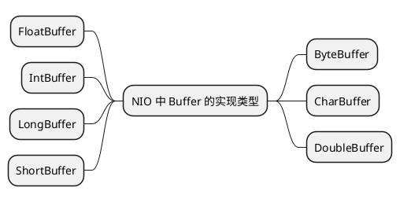
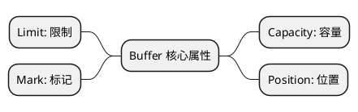

# NIO 核心组件 Buffer

在Java NIO中，Buffer是一个非常核心的概念。它是一个对象，包含一些要写入或者刚读出的数据。在NIO库中，缓冲区是处理数据的中心，所有数据都通过缓冲
区来处理。

## Buffer 的类型 {id="types"}

NIO 中的 Buffer 类针对除了 Boolean 类型外，都有具体的类型的实现，如下:



## Buffer 读写示例 {id="read-write-example"}

下面是一个简单的读写 Buffer 的示例:
```Java
// 创建一个长度为 10 的 Buffer
ByteBuffer buffer = ByteBuffer.allocate(10);
// 写入从 0 到 9 的数字
for (int i = 0; i < buffer.capacity(); i++) {
    buffer.put((byte) i);
}
// 更改为 Buffer 读模式
buffer.flip();
// 读取数据
while (buffer.hasRemaining()) {
    System.out.println(buffer.get());
}
```
Buffer 本事是作为一种容器来临时存储数据，单独使用它没什么实际意义。通常是结合 Channel 应用在文件 I/O 或者网络 I/O 的场景中。虽然如此，它确是
 NIO 的基石，配和 Channel 可以支持复杂的数据处理流程。

<warning>
注意： Buffer 以及其子类并非是线程安全的，如果多个线程尝试修改通一个 Buffer 实例的内容, 会导致数据不一致的问题。需要自行实现同步机制。比如使用
`synchronized` 关键字或者 `Lock` 机制对读写顺序进行限制。
</warning>

## Buffer 的关键方法 {id="methods"}

下面这些方法在不同类型的 Buffer 中都是通用的，列举如下，以备查询:

| 方法名称                        | 描述                                                                  |
|-----------------------------|---------------------------------------------------------------------|
| `allocate(int capacity)`    | 分配一个新的缓冲区。                                                          |
| `capacity()`                | 返回缓冲区的容量，即可以存储在缓冲区中的最大数据元素数量。                                       |
| `position()`                | 返回缓冲区当前的位置。位置表示下一个要读取或写入的元素的索引。                                     |
| `position(int newPosition)` | 设置缓冲区的位置。如果位置被设置为一个较小的数值，缓冲区可以重新读取或写入已经存在的数据。                       |
| `limit()`                   | 返回缓冲区的限制，即第一个不能被读或写的元素的索引。                                          |
| `limit(int newLimit)`       | 设置缓冲区的限制。如果限制被设置为一个较小的数值，不能访问缓冲区中的某些数据。                             |
| `mark()`                    | 标记缓冲区的当前位置，之后可以通过调用`reset()`方法恢复到这个位置。                              |
| `reset()`                   | 将缓冲区的位置重置为以前标记的位置。                                                  |
| `clear()`                   | 清空缓冲区，为再次写入数据做准备。`position`会被设置为0，`limit`被设置为容量的值。                  |
| `flip()`                    | 将缓冲区从写模式切换到读模式。`limit`被设置为当前`position`的值，然后`position`被设置为0。         |
| `rewind()`                  | 重置缓冲区的位置为0，可以重新读取缓冲区中的所有数据。`limit`不变。                               |
| `compact()`                 | 压缩缓冲区。将所有未读的数据拷贝到缓冲区的起始处，然后将`position`设到最后一个未读元素之后。`limit`被设置为容量的值。 |
| `hasRemaining()`            | 如果`position`和`limit`之间有元素，则返回`true`。                                |
| `remaining()`               | 返回`position`和`limit`之间的元素数量。                                        |


## Buffer 原理详解 {id="how-it-works"}

Buffer 是一个对象，但本质上是一个数组。它有四个关键的属性:

