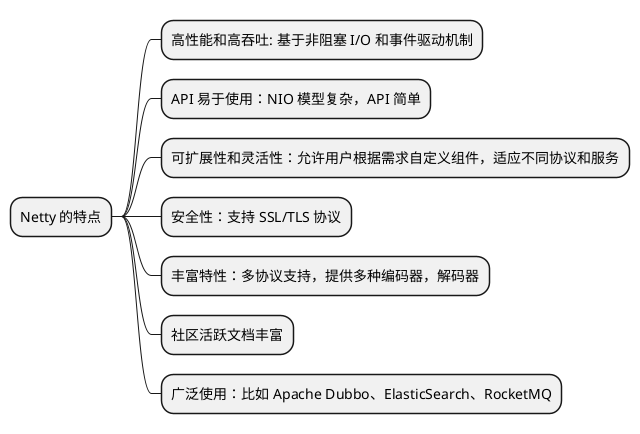

# Netty

这篇文档介绍了 Netty 的基础概念、核心组件。在这个基础上，开发一个 Netty 的应用，包含基础的客户端和服务端。然后深入 Netty 的高级特性，以及
编解码技术。最后介绍 Netty 在实际项目中的应用以及扩展和维护相关的内容。

## Netty 简介 {id="intro"}

Netty 是一个高性能的 Java 网络编程框架，主要用于快速开发可扩展的网络应用程序。它是基于 NIO (Non-blocking I/O) 实现的，为用户提供了一个
简单易用的 API 来创建服务器和客户端网络应用程序。

## Netty 的架构 {id="arch"}

这张图是Netty的架构图，它展示了Netty的核心组件和它们之间的关系。从上到下，我们可以看到以下内容：

1. **Transport Services（传输服务）**：这部分列出了Netty支持的不同传输服务类型，包括Socket & Datagram、HTTP Tunnel和In-VM Pipe。

2. **Protocol Support（协议支持）**：这部分展示了Netty支持的各种协议，包括HTTP & WebSocket、SSL / StartTLS、Google Protobuf、zlib/gzip Compression、Large File Transfer和RTSP。

3. **Core（核心）**：这部分是Netty的核心组件，包括：
    - **Extensible Event Model（可扩展事件模型）**：这是一个灵活的事件处理模型，允许用户自定义事件处理器。
    - **Universal Communication API（通用通信API）**：这是一个统一的API，用于处理各种传输服务和协议。
    - **Zero-Copy-Capable Rich Byte Buffer（零拷贝能力丰富的字节缓冲区）**：这是一种高效的数据缓冲技术，可以减少内存复制操作，提高性能。

这些组件共同构成了Netty的框架结构，使得开发者能够轻松地构建高性能、高可靠性的网络应用程序。通过使用这些组件，开发者可以专注于业务逻辑，而无需关心底层的网络实现细节。

## Netty 为什么使用 NIO {id="why-netty-use-nio"}

Netty 为什么使用 NIO 而不是 AIO 呢？主要理由如下:

* AIO 的底层使用的仍然是 Epoll ，JDK 封装了一层不容易深度优化
* Netty 的整体架构是 reactor 模型，而 AIO 是 proactor 模型
* Linux 上的 AIO 还不够成熟，处理回调结果的速度不够快