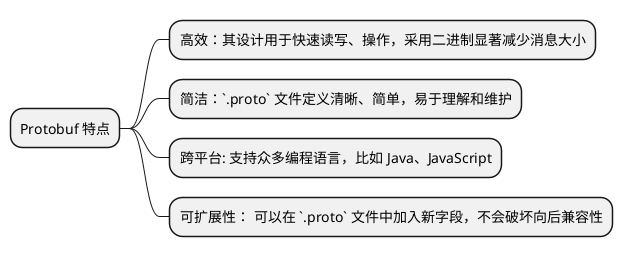
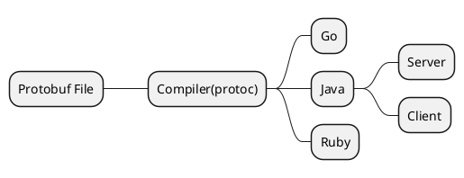

# 使用 Protobuf 序列化协议

这篇文档介绍了 Protobuf 协议，并且详细描述了 `Protobuf` 文件的编写。最后介绍了如何在 Java 中使用 Protobuf, 包括编写、编译以及序列化和反
序列化。

## Protobuf 简介 {id="protobuf"}

Protocol Buffers（简称 Protobuf）是由 Google 开发的一种语言无关、平台无关、可扩展的序列化结构数据的协议。它被设计用于高效地序列化结构化数
据，类似于 XML，但比 XML 更小、更快、更简单。

Protobuf 最初是为了满足在网络通信和存储过程中对于高效和可靠的序列化协议的需求。与 JSON 或 XML 等文本协议相比，Protobuf 是二进制格式，这意
味着它可以更快地被解析，同时占用更少的带宽。



其工作流程如下:


可以看到，我们编写的 Protobuf 文件，编译成其他语言的代码后，序列化成二进制或者从二进制反序列化。最后，Server 和 Client 都像使用 JSON 一样
使用它。

## 安装依赖 {id="dependence"}

我们使用 Maven 来管理依赖，在项目的 `pom.xml` 配置文件中，加入 Protobuf 所需的依赖。下面是 Protobuf 所需要的 Java 核心库:
```xml
<!-- https://mvnrepository.com/artifact/com.google.protobuf/protobuf-java -->
<dependency>
    <groupId>com.google.protobuf</groupId>
    <artifactId>protobuf-java</artifactId>
    <version>3.25.2</version>
</dependency>
```

接着需要添加 Protobuf 编译插件:
```xml
<plugins>
    <plugin>
        <groupId>kr.motd.maven</groupId>
        <artifactId>os-maven-plugin</artifactId>
        <version>1.7.1</version>
        <executions>
            <execution>
                <phase>initialize</phase>
                <goals>
                    <goal>detect</goal>
                </goals>
            </execution>
        </executions>
    </plugin>

    <plugin>
        <groupId>org.xolstice.maven.plugins</groupId>
        <artifactId>protobuf-maven-plugin</artifactId>
        <version>0.6.1</version>
        <configuration>
            <protocArtifact>
                com.google.protobuf:protoc:3.25.2:exe:${os.detected.classifier}
            </protocArtifact>
        </configuration>
        <executions>
            <execution>
                <goals>
                    <goal>compile</goal>
                    <goal>test-compile</goal>
                </goals>
            </execution>
        </executions>
    </plugin>
</plugins>
```

`protobuf-maven-plugin` 主要用于 Protobuf 在 Maven 项目中的自动编译和配置。而 `os-maven-plugin` 是前者依赖的用于操作系统检测的插件。

## 编写 proto 文件 {id="write-proto"}

接着，我们来编写 `proto` 文件，以用户登录这个场景为示例。编写文件命名为 `src/main/proto/UserLoginEvent.proto`，内容如下:
```
syntax = "proto3";

option java_multiple_files = true;
option java_package = "icu.hacking.protobuf";
option java_outer_classname = "events";

message UserLoginRequest {
    string username = 1;
    string password = 2;
}
```

这段 Protobuf（Protocol Buffers）代码定义了一个用于用户登录请求的数据结构。以下是每一部分的详细说明：

1. `syntax = "proto3";`: 这行声明了使用 Protobuf 的第三版语法。Protobuf 3 是最新的，并且与 Protobuf 2 向后兼容。

2. `option java_multiple_files = true;`: 这个选项设置为 `true` 意味着 Protobuf 编译器（`protoc`）在将这个 `.proto` 文件编译成 
Java 代码时，会为每个 message 生成一个单独的 Java 文件，而不是所有的 message 都嵌套在一个外部类里面。

3. `option java_package = "icu.hacking.protobuf";`: 这个选项指定生成的 Java 代码将有一个包声明，即 `package icu.hacking.protobuf;`
。这样做是为了组织代码，避免命名冲突，并且允许其他 Java 代码可以导入并使用这些生成的类。

4. `option java_outer_classname = "events";`: 这个选项指定如果 `java_multiple_files` 设置为 `false` 或未设置，所有的 message 
会被嵌套在一个名为 `events` 的外部类中。即使 `java_multiple_files` 设置为 `true`，`events` 还是会被用作生成的 Java 文件中的一些元数据
（如服务描述符）的类名。

5. `message UserLoginRequest { ... }` : 这个 `message` 定义了一个数据结构，用于用户登录请求。在这里，`UserLoginRequest` 是一个具
有两个字段的 message：
   - `string username = 1;` 这是第一个字段，表示用户登录时使用的用户名，字段编号为 1。
   - `string password = 2;` 这是第二个字段，表示用户的密码，字段编号为 2。
   - 在 Protobuf 中，每个字段都有一个唯一的编号，这些编号在 message 的二进制格式中被使用，并且在 message 的生命周期中不应该改变。这允许数
据格式在不破坏向后兼容性的情况下进行演进。

> 需要注意的是，我们的 `.proto` 文件默认是存放在 `src/main/proto` 目录下的，因为这是 `protobuf-maven-plugin` 插件默认会去查找的目录。
> 没有特殊情况，使用默认的目录就可以，如果需要特殊指定，需要在 `pom.xml` 文件中额外配置。

## 编译并应用 {id="compile-and-apply"}

接着，我们可以重新构建 Maven 的项目，如果前面插件安装以及配置没有错。会自动去下载对应操作系统的 Protobuf 的编译器，将我们编写的 `.proto` 文件
编译成 Java 文件。

```Java
// 构建对象
UserLoginRequest request = UserLoginRequest.newBuilder()
        .setUsername("admin")
        .setPassword("admin")
        .build();
// 序列化和反序列化
UserLoginRequest userLoginRequest = UserLoginRequest.parseFrom(request.toByteArray());
System.out.println("userLoginRequest.getPassword() = " + userLoginRequest.getPassword());
```

对于客户端来说，也需要传输 Protobuf 格式的消息。比如 JavaScript 可以安装 `protobuf.js`。

## 总结 {id="summary"}

这篇技术文档介绍了 Protocol Buffers（简称 Protobuf）协议，并提供了关于如何编写 Protobuf 文件以及在 Java 中使用 Protobuf 的详细说明。

文档主要内容如下：

1. **Protobuf 简介**：
   - Protobuf 是一种由 Google 开发的语言无关、平台无关、可扩展的序列化结构数据协议。
   - 它被设计用于高效地序列化结构化数据，相对于 XML 更小、更快、更简单。
   - Protobuf 最初为网络通信和存储过程中高效可靠的序列化协议而设计，它采用二进制格式，因此解析速度更快，占用更少的带宽。
   - Protobuf 的特点包括高效、简洁、跨平台支持以及可扩展性。

2. **安装依赖**：
   - 文档介绍了如何使用 Maven 来管理依赖，以便在 Java 项目中使用 Protobuf。
   - 配置了项目的 `pom.xml` 文件以引入 Protobuf 的 Java 核心库和编译插件。

3. **编写 proto 文件**：
   - 文档示范了如何编写一个示例的 Protobuf 文件，以用户登录请求为例。
   - 详细解释了各个部分的含义，包括选择 Protobuf 3 语法、设置 Java 包声明、指定外部类名、定义 message 结构等。

4. **编译并应用**：
   - 文档指导如何使用 Maven 构建项目，自动下载并使用适合操作系统的 Protobuf 编译器，将 `.proto` 文件编译成 Java 代码。
   - 提供了示例代码，展示如何在 Java 中使用生成的 Protobuf 类。

5. **其他客户端支持**：
   - 提及了如何在客户端中传输 Protobuf 格式的消息，例如 JavaScript 中可以使用 `protobuf.js` 库。

总之，这篇文档为读者提供了深入了解 Protobuf 协议、在 Java 项目中使用 Protobuf 的详细指南，从依赖管理到编写 Protobuf 文件再到实际应用都有
清晰的说明和示例。