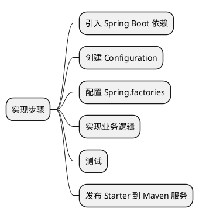

# Spring Boot Starter

Spring Boot Starter 是 Spring Boot 的一个重要特性，主要用于简化依赖管理并自动配置应用。每一个 Starter 都提供了对某个特性技术的集成，如 JPA
、Thymeleaf 等等。其核心思想是“约定优于配置”，也就是说，Spring Boot Starter 会自动帮我们进行大部分通用配置，从而省去很多工作。这篇文档描述了
如何编写一个 Spring Boot Starter 并集成到 Spring Boot 中去。

## 封装 RocketMQ {id="rocketmq-spring-boot-starter"}

下面我们会从 0 到 1 完成一个 Spring Boot Starter。这个案例是对 RocketMQ 二次封装，暴露一个发送的接口给引入这个 Starter 的应用。这个过程
所需的步骤如下:



## 引入 SpringBoot 依赖 {id="import-spring-boot"}

我们需要将 SpringBoot 的依赖添加到我们的项目中，这边的依赖最好和使用者所依赖的 SpringBoot 的版本相同或者相近，不然会出现兼容问题。
```xml
<parent>
    <groupId>org.springframework.boot</groupId>
    <artifactId>spring-boot-starter-parent</artifactId>
    <version>2.4.3</version>
    <relativePath/>
</parent>

<dependencies>
    <dependency>
        <groupId>org.springframework.boot</groupId>
        <artifactId>spring-boot-starter</artifactId>
    </dependency>
</dependencies>
```

## 创建配置 {id="create-configuration"}

首先我们需要创建一个自动配置 RocketMQ 的类，这个类通常被称为 `AutoConfiguration`。在比如 `src/main/java/com/example` 目录下创建一个名为
`RocketMQAutoConfiguration.java` 的文件，内容如下:
```Java
import org.springframework.context.annotation.Configuration;

@Configuration
public class RocketMQAutoConfiguration {

}
```

在这个配置类中，你可以读取 SpringBoot 中的配置,例如:
```Java
@Configuration
@EnableConfigurationProperties(value = RocketMQProperties.class)
public class RocketMQAutoConfiguration {

    private final RocketMQProperties properties;
    
    public MessageServiceAutoConfiguration(RocketMQProperties properties) {
        this.properties = properties;
    }

}
```

上面示例中的 `RocketMQProperties.class` 是一个数据类，包含了配置字段的 `Getter/Setter` :
```Java
@ConfigurationProperties(prefix = "rocketmq")
public class RocketMQProperties {

    private String nameServer;

    public String getNameServer() {
        return nameServer;
    }

    public void setNameServer(String nameServer) {
        this.nameServer = nameServer;
    }

}
```

## 配置 Spring.factories {id="configuration-spring-factories"}

最后，我们只需要修改 `resources/META-INF/spring.factories`，内容如下:
```yaml
org.springframework.boot.autoconfigure.EnableAutoConfiguration=com.example.MessageServiceAutoConfiguration
```

到这里，我们已经完成了一个 Spring Boot Starter 项目的初始结构。接下去的事情就是编写它所需要的业务逻辑了。

## 实现业务逻辑 {id="functions"}

首先，我们需要引入 `rocketmq-spring-boot-starter`, 简化了 RocketMQ 的操作:
```xml
<dependency>
    <groupId>org.apache.rocketmq</groupId>
    <artifactId>rocketmq-spring-boot-starter</artifactId>
    <version>2.2.3</version>
</dependency>
```

我们这个 Starter 是提供对 RocketMQ 的封装，然后暴露对外发送消息的接口。所以，在项目启动的时候，我们需要启动一个 Producer, 并且配置它:
```Java
@Configuration
@EnableConfigurationProperties(value = RocketMQProperties.class)
public class MessageServiceAutoConfiguration {
    // ...省略重复的代码
    
    @Bean
    public DefaultMQProducer defaultMQProducer() {
        DefaultMQProducer producer = new DefaultMQProducer("GID_APP");
        producer.setNamesrvAddr(properties.getNameServer());
        return producer;
    }

    @Bean
    public RocketMQTemplate rocketMQTemplate(DefaultMQProducer producer) {
        RocketMQTemplate rocketMQTemplate = new RocketMQTemplate();
        rocketMQTemplate.setProducer(producer);
        return rocketMQTemplate;
    }
}
```

上面的示例中，我们初始化了两个 Bean, 第一个是配置 `DefaultMQProducer`, 然后配置 `RocketMQTemplate`，它将自动启动生产者。

最后，我们需要对外提供一个接口发送消息:
```Java
public interface IMessageService {

    String sendMessageToUser();

}
```
实现这个接口:
```Java
@Service
public class MessageServiceImpl implements IMessageService {

    private final RocketMQTemplate rocketMQTemplate;

    public MessageServiceImpl(RocketMQTemplate rocketMQTemplate) {
        this.rocketMQTemplate = rocketMQTemplate;
    }

    @Override
    public String sendMessageToUser() {
        // TODO: 这里实现发送消息
    }

}
```

然后我们还需要在 `MessageServiceAutoConfiguration` 类中，创建一个 `IMessageService` 的 Bean:
```Java
@Configuration
@EnableConfigurationProperties(value = RocketMQProperties.class)
public class MessageServiceAutoConfiguration {
    // ...省略重复的代码
    
    @Bean
    public IMessageService messageService(RocketMQTemplate rocketMQTemplate) {
        return new MessageServiceImpl(rocketMQTemplate);
    }
}
```

至此，我们完成了业务逻辑的编写。接下来，可以引入单元测试了。

## 单元测试 {id="unittest"}

首先，我们需要引入 `spring-boot-starter-test` 的依赖:
```xml
<dependency>
    <groupId>org.springframework.boot</groupId>
    <artifactId>spring-boot-starter-test</artifactId>
</dependency>
```

编写测试用例:
```Java
@SpringBootTest
@ContextConfiguration(classes = {MessageServiceImpl.class})
public class MessageServiceImplTest {

    @Autowired
    private IMessageService messageService;

    @MockBean
    private RocketMQTemplate rocketMQTemplate;

    @Test
    public void testSendMessageToUser() {
        String result = messageService.sendMessageToUser();
        Assertions.assertEquals("7F00000100025910E4406DFF20660001", result);
    }

}
```

对于大部分应用来说，只是单元测试是不够的，还需要引入集成测试，这么做可以验证这个编写的 Starter 能否在一个实际的应用中正常工作。

## 发布 Starter 到 Maven 私服 {id="publish-to-maven"}

首先，我们需要在 Starter 项目的 `pom.xml` 文件中，加入如下内容:
```xml
<distributionManagement>
    <repository>
        <id>releases</id>
        <url>http://localhost:8081/nexus/content/repositories/releases</url>
    </repository>
    <snapshotRepository>
        <id>snapshots</id>
        <url>http://localhost:8081/nexus/content/repositories/snapshots</url>
    </snapshotRepository>
</distributionManagement>
```
这里，`<repository>` 节点定义了你的发布（非快照）版本的仓库的位置，`<snapshotRepository>` 定义了快照版本的仓库位置。记得将 URL 替换为你的
Maven 仓库的 URL。

然后在 Maven 的 `settings.xml` （通常位于你的用户目录的 `.m2` 目录中）添加对应的服务器节点:
```xml
<servers>
  <server>
    <id>releases</id>
    <username>admin</username>
    <password>admin123</password>
  </server>
  <server>
    <id>snapshots</id>
    <username>admin</username>
    <password>admin123</password>
  </server>
</servers>
```
上面的 `<username>` 和 `<password>` 应该被替换为 `Maven` 仓库的用户名和密码。

最后部署即可:
```Shell
mvn clean deploy
```
这个命令将会构建你的项目，运行任何测试，并将其发布到你在 pom.xml 文件中定义的 Maven 仓库中。

## 集成测试 {id="integration-testing"}

上文中，我们已经完成了单元测试，并且将 Starter 发布到 Maven 的私有服务器上。接下来，我们就可以做集成的测试了。

首先，我们创建一个新的 Spring Boot 应用。然后引入我们的依赖:
在 `pom.xml` 中加入如下配置:
```xml
<dependency>
   <groupId>com.example</groupId>
   <artifactId>message-service-spring-boot-starter</artifactId>
   <version>1.0.0-SNAPSHOT</version>
</dependency>
```

然后，在 `application.yml` 中配置 RocketMQ 的 `NameServer` 或者其他参数:
```yaml
rocketmq:
  name-server: 127.0.0.1:9876
```
最后，在项目中调用接口:
```Java
@Autowired
private IMessageService messageService;

String result = messageService.sendMessageToUser();
```

## 总结 {id="summary"}

这篇文档介绍了如何编写一个 Spring Boot Starter 并集成到 Spring Boot 中去。 文档主要内容如下:

* 介绍了 Spring Boot Starter 的概念和优势
* 演示了如何从零开始创建一个 Spring Boot Starter，以 RocketMQ 为例
* 详细介绍了编写 Starter 的各个步骤，包括：
  * 引入 Spring Boot 依赖
  * 创建自动配置类
  * 配置 Spring.factories
  * 实现业务逻辑
  * 单元测试
  * 发布 Starter 到 Maven 私服
  * 集成测试