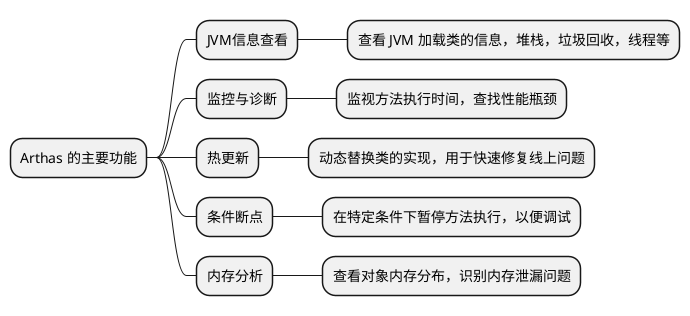

# Arthas 工具的使用

Arthas 是阿里巴巴开源的 Java 诊断工具，通常用于在线诊断 Java 生产环境中的问题，比如监视 Java 应用程序的运行时状态和性能指标。它能够在不中断应用
程序运行的情况下，动态地查看和修改 JVM 当前的状态。

## Arthas 的功能 {id="feature"}

介绍一下 Arthas 的功能:



## 安装 {id="install"}

Arthas 是一个 Jar 包，所以只要是下载并使用 `java` 命令启动就可以了:
```Shell
curl -O https://arthas.aliyun.com/arthas-boot.jar
java -jar arthas-boot.jar
```

## 基本使用 {id="usage"}

启动之后，可以选择 Java 的进程，然后进行相关的操作:


选择进程之后，会进入一个 Shell 的终端，可以通过命令来查看进程的相关信息:


比如说查看 `dashhoard`, 输入这个命令即可:


> 要退出 `dashboard` 可以输入 `q` 按键。

我们要查看进程 1 的信息(通常这是 `main` 主进程), 可以输入 `thread 1`:


反编译一个类: `jad <完整类名>`:


## 总结 {id="summary"}

这篇文档描述了 Arthas 的特性、安装以及基本使用。更多的信息，还需要参考[官方文档](https://arthas.aliyun.com/)。