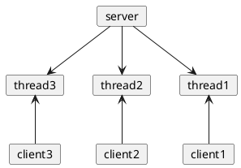
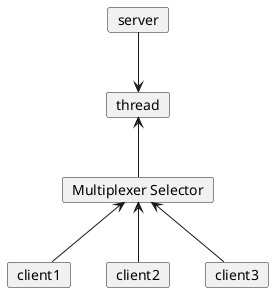

# 三种IO模型:BIO/NIO/AIO

在Java网络编程领域，对I/O处理模型的选择直接决定了应用程序的性能、可伸缩性和资源利用效率。随着技术的发展和需求的变化，Java提供了多种I/O处理方
式以应对不同的场景：传统的BIO (Blocking I/O)，革新性的NIO (Non-blocking I/O)，以及高性能的AIO (Asynchronous I/O, 或称为 NIO.2)。

## IO 模型的历史 {id="history"}

在 Java 1.0 版本中引入了 BIO（Blocking I/O）, 在这个模型中，如果发生 I/O 操作会导致执行它们的线程阻塞，直到操作完成，所以被成为阻塞式 I/O。
**这种 I/O 模型最大的问题是，每个连接都需要一个线程处理，线程资源消耗大** 。可以想象，如果一个在线游戏，有一万人在线，要启动一万个线程吗。

在 Java 1.4 版本中引入了 NIO（New I/O 或者 Non-Blocking-IO），引入了 通道（Channel）、缓冲区（Buffer）和选择器（Selector）的概念。它
支持非阻塞模式，单个线程可以处理多个 Channel，通过 Buffer 来双向读写数据。这样使得它显著提升了资源的利用率和系统的吞吐量。

在 Java 7 中，引入了 NIO 2，也成为 AIO，可以使得 I/O 操作完全异步执行，进一步提高了程序处理并发的能力，减少了对线程的需求。

| 特性/模型       | BIO（阻塞式I/O）           | NIO（非阻塞式I/O）                   | AIO（异步I/O）                          |
|-------------|-----------------------|--------------------------------|-------------------------------------|
| **基本原理**    | 线程在等待数据时会阻塞           | 使用单个线程来处理多个连接的数据，非阻塞方式操作数据流    | 完全异步处理，I/O操作完成后通知应用程序               |
| **I/O操作**   | 阻塞式读写                 | 非阻塞式读写，通过选择器管理多个通道的I/O事件       | 异步读写，应用程序可以直接继续执行，不等待I/O完成          |
| **数据处理方式**  | 流式读写(字节流)             | 缓冲区读写                          | 缓冲区读写                               |
| **线程模型**    | 每个连接一个线程              | 单线程可以处理多个连接                    | 不需要为每个I/O操作分配线程，通过回调或者Future处理结果    |
| **资源消耗**    | 高，因为每个连接都需要一个线程       | 较低，使用选择器有效管理多个通道               | 较低，异步操作减少了线程的使用                     |
| **性能和可扩展性** | 低，难以支持高并发             | 高，适合处理高并发连接                    | 高，提供了更好的性能和可扩展性，适合高并发和大量数据交换的应用场景   |
| **编程复杂度**   | 低，API简单易用             | 中等，需要管理选择器，通道和缓冲区等             | 高，需要处理回调函数，Future对象等异步编程概念          |
| **适用场景**    | 适合连接数少且固定，对实时性要求不高的应用 | 适用于需要非阻塞操作和大量连接的应用，如聊天服务器、网络游戏 | 适合大规模并发连接及高性能要求的应用，如大型网络服务器和高性能交易系统 |


## BIO {id="blocking-io"}

我们先来看最早期的 BIO 的模型图:



BIO 是一种同步阻塞模型，每一个客户端会绑定一个单独的线程来执行。当线程调用读或者写操作的时候，就会一只阻塞，知道数据准备好或者操作完成。 虽然
模型直观简单，但是其性能在大量 IO 的情况下并不好。

接着，我们来写一个简单的 Echo 的示例。包含服务端和客户端两部分，下面是服务端的代码:
```Java
try (ServerSocket serverSocket = new ServerSocket(1024)) {
    while (true) {
        Socket clientSocket = serverSocket.accept();
        new Thread(() -> {
            try (BufferedReader in = new BufferedReader(new InputStreamReader(clientSocket.getInputStream()));
                 PrintWriter out = new PrintWriter(clientSocket.getOutputStream(), true)) {
                out.println("Echo: " + in.readLine());
            } catch (IOException e) {
                throw new RuntimeException(e);
            }
        }).start();
    }
}
```
在上面的代码中，需要注意下面三个点：

* `serverSocket.accept()` 是一个 I/O 阻塞的操作。
* 每处理一个请求，就需要启动一个线程。
* `InputStream`、`OutputStream` 这些都是通过字节流和字符流进行操作的。

然后，我们写一个客户端测试:
```Java
try (Socket socket = new Socket("127.0.0.1", 1024)) {
    try (
            PrintWriter out = new PrintWriter(socket.getOutputStream(), true);
            BufferedReader in = new BufferedReader(new InputStreamReader(socket.getInputStream()));
            ) {
        out.println("Hello");
        System.out.println(in.readLine());
    }
}
```


## NIO {id="non-blocking-io"}

NIO 有两种解释，一种是 New I/O，另一种是 Non-Blocking I/O。一般更倾向于第二种解释，道出了其本质，非阻塞 I/O。它是在 Java 1.4 版本中引入。



它主要位于 `java.nio` 包中，提供了 `Channel`、`Buffer`、`Selector` 等核心组件。这些概念将在后续的章节中详解。

相比 BIO，它使用 `Channel` 替代了 `Stream`，支持双向通信、同时读写。

使用 `Buffer` 作为容器，用于存储从 `Channel` 读取或者写入到 `Channel` 的数据，提供了一种基于缓存区批量处理的方式。

`Selector` 允许单个线程管理多个 `Channel`, 通过注册感兴趣的事件（如连接就绪、读就绪、写就绪）并轮询这些事件来决定哪个Channel准备好了进行
IO 操作，从而避免了为每个连接创建独立线程的开销。

在单个线程内，对某一个 Channel 的读写操作依然是按照顺序执行，即必须等待上一次操作完成后才能继续。所以，它依然是同步模型。

现在，我们通过 NIO 来重构上文中的 Echo 示例。其中服务端的代码如下:
```Java
try (Selector selector = Selector.open();
     ServerSocketChannel serverSocketChannel = ServerSocketChannel.open()
) {
    serverSocketChannel.bind(new InetSocketAddress(1024));
    serverSocketChannel.configureBlocking(false);
    serverSocketChannel.register(selector, SelectionKey.OP_ACCEPT);
    while (true) {
        selector.select();
        Iterator<SelectionKey> keyIterator = selector.selectedKeys().iterator();

        while (keyIterator.hasNext()) {
            SelectionKey key = keyIterator.next();
            keyIterator.remove();

            if (key.isAcceptable()) {
                ServerSocketChannel server = (ServerSocketChannel) key.channel();
                SocketChannel client = server.accept();
                client.configureBlocking(false);
                client.register(selector, SelectionKey.OP_READ);
            } else if (key.isReadable()) {
                SocketChannel client = (SocketChannel) key.channel();
                ByteBuffer buffer = ByteBuffer.allocate(1024);
                int bytesRead = client.read(buffer);
                if (bytesRead > 0) {
                    buffer.flip();
                    client.write(buffer);
                    buffer.clear();
                } else if (bytesRead == -1) {
                    client.close();
                }
            }
        }
    }
}
```

看起来，这个示例比之前使用 BIO 编写的要复杂的多。包含了 `Buffer`、`Channel` 以及 `Selector` 等新概念新 API。现在先不详细解释这个示例，但
需要注意下面这几点:

* **非阻塞模式**：NIO 的 `ServerSocketChannel` 和 `SocketChannel` 都被配置为非阻塞模式。这意味着，在执行I/O操作时，如果没有数据可读或
可写，程序将立即返回而不是阻塞等待。
* `Selector`：服务器端使用 `Selector` 来管理多个通道的I/O事件，如接受新的连接、读取数据。这允许单个线程高效地管理多个客户端连接。
* `ByteBuffer`：数据的读写是通过 `ByteBuffer` 进行的。在写数据之前需要调用 `flip()` 方法，读取完数据后需要调用 `clear()` 或
`compact()`方法准备下一次写入或读取。

## AIO {id="asynchronous-io"}

Java AIO（Asynchronous I/O，即NIO.2）提供了一种完全异步的I/O操作方式，允许I/O操作完成后通过回调通知应用程序。AIO是在Java 7中引入的，
旨在提高大规模网络应用的性能。

我们继续，使用 AIO 来重构 Echo 的示例，下面是 Server 端的代码:
```Java
public class AIOEchoServer {

    static class EchoCompletionHandler implements CompletionHandler<Integer, ByteBuffer> {

        private final AsynchronousSocketChannel client;

        EchoCompletionHandler(AsynchronousSocketChannel client) {
            this.client = client;
        }

        @Override
        public void completed(Integer result, ByteBuffer attachment) {
            if (result == -1) {
                try {
                    client.close();
                } catch (IOException e) {
                    throw new RuntimeException(e);
                }
                return ;
            }
            attachment.flip();
            client.write(attachment, attachment, new CompletionHandler<Integer, ByteBuffer>() {
                @Override
                public void completed(Integer result, ByteBuffer buffer) {
                    if (buffer.hasRemaining()) {
                        buffer.compact();
                        client.read(buffer, buffer, EchoCompletionHandler.this);
                    } else {
                        buffer.clear();
                        client.read(buffer, buffer, EchoCompletionHandler.this);
                    }
                }

                @Override
                public void failed(Throwable exc, ByteBuffer attachment) {}
            });
        }

        @Override
        public void failed(Throwable exc, ByteBuffer attachment) {}
    }

    public static void main(String[] args) throws IOException, InterruptedException {
        AsynchronousServerSocketChannel listener = null;
        InetSocketAddress address = new InetSocketAddress("127.0.0.1", 1024);
        try {
            listener = AsynchronousServerSocketChannel.open().bind(address);
            AsynchronousServerSocketChannel finalListener = listener;
            listener.accept(null, new CompletionHandler<AsynchronousSocketChannel, Object>() {
                @Override
                public void completed(AsynchronousSocketChannel client, Object attachment) {
                    finalListener.accept(null, this);
                    ByteBuffer buffer = ByteBuffer.allocate(1024);
                    client.read(buffer, buffer, new EchoCompletionHandler(client));
                    System.out.println("Client connected");
                }

                @Override
                public void failed(Throwable exc, Object attachment) {
                }
            });
            Thread.currentThread().join();
        } finally {
            if (listener != null) {
                listener.close();
            }
        }
        Thread.currentThread().join();
    }
}
```

* `EchoCompletionHandler` 是一个静态内部类，实现了 `java.nio.channels.CompletionHandler` 接口。这个类用来处理异步操作的完成事件，
包括操作成功完成和操作失败两种情况。`Completionhandler` 是 Java NIO 的异步操作模型当中，用来处理 IO 操作完成事件的回调接口。

* `EchoCompletionHandler` 类有一个 `AsynchronousSocketChannel` 的字段 `client`，存储了与客户端通信的异步套接字通道。
* 在 `EchoCompletionHandler` 的 completed 方法中，如果 `result` 等于 `-1`，表示客户端已经关闭，此时关闭服务器端的套接字通道。如果 
`result` 不是 `-1`，表示读取到了一些数据，然后将 `buffer` 翻转，并将数据写回客户端。
* `main` 方法中，我们创建了一个 `AsynchronousServerSocketChannel` 的实例并绑定到了本地的 1024 端口。然后这个实例开始接受连接请求。
当有客户端连接上来后，会调用 `CompletionHandler` 的 `completed` 方法，打印 `Client connected` 并读取客户端发送的数据。
* 最后，我们在 `finally` 代码块中关闭了 `AsynchronousServerSocketChannel` 实例，以释放系统资源。

接着，我们写一个 Client 测试:
```Java
public static void main(String[] args) throws IOException, ExecutionException, InterruptedException {
    try (AsynchronousSocketChannel client = AsynchronousSocketChannel.open()) {
        client.connect(new InetSocketAddress("127.0.0.1", 1024)).get();
        ByteBuffer buffer = ByteBuffer.wrap("Hello World".getBytes());
        Future<Integer> result = client.write(buffer);
        result.get();
        buffer.flip();
        Future<Integer> readResult = client.read(buffer);
        readResult.get();
        String response = new String(buffer.array()).trim();
        buffer.clear();
        System.out.println("Echo: " + response);
    }
}
```

## 总结 {id="summary"}

这篇文档，我们分别介绍了 BIO、NIO 以及 AIO 三种 IO 模型。并且通过一个 Echo 的简单示例，使用三种模型分别实现。但是并没有立即深入到这三种 I/O
模型的细节中去。通过这篇文档，只要对三种 I/O 模型有初步的认识即可。之后，我们将更加深入地介绍 NIO 模型中的核心概念以及更多细节。

## 参考 {id="reference"}

1. [《Essential Technologies for Java Developers: I/O and Netty》- Medium](https://alibaba-cloud.medium.com/essential-technologies-for-java-developers-i-o-and-netty-ec765676fd21)
