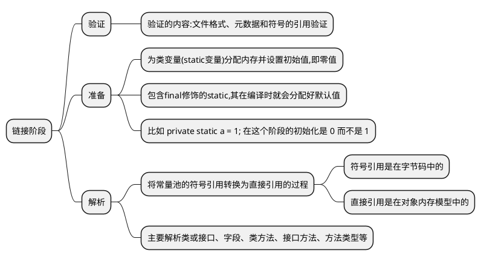
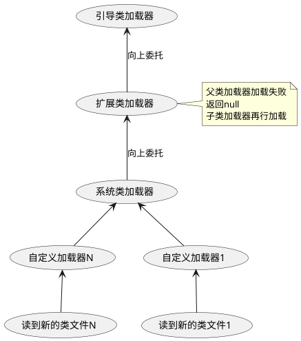

# 类加载系统的工作过程 

这篇文档描述了 Java 中类的加载系统整体的工作过程。主要分为三步:

1. 加载文件阶段，读入字节码文件并加载到内存
2. 链接阶段，验证字节码、符号引用转为直接引用
3. 初始化阶段，为创建对象做必要的准备

### 加载阶段

加载阶段，是通过 IO 操作读入文件的过程，主要做了下面三件事：

1. 通过类的全限定名获取二进制字节流，就是读文件的操作
2. 将这个字节流所代表的静态存储结构转化为内存结构
3. 在内存中生成一个代表这个类的`java.lang.Class`对象

### 验证阶段

验证阶段分为三个字阶段，分别是验证、准备以及解析。

### 初始化阶段

初始化阶段就开始执行代码了，处理类变量和静态变量。

### 加载器的类别

在 Java 中，有几种不同的内置 `ClassLoader` 实现，例如：

-  **Bootstrap ClassLoader**：也称为引导类加载器，负责加载核心 Java 类，是 JVM 的一部分，由 JVM 自身实现，无法直接在 Java 代码中获取。 它是由 C++ 实现的。
-  **Extension ClassLoader**：负责加载扩展目录（`jre/lib/ext`）下的类。
-  **System ClassLoader**：也称为应用类加载器，负责加载应用程序类路径下的类。
-  _**自定义加载器**： 这部分用的比较少， Tomcat 容器有使用到。_

### 双亲委派机制

出于以下原因，所以要增加双亲委派机制:

1. 基于安全，防止核心 API 库被随意篡改
2. 避免重复加载，当父加载器已经加载过该类时，子加载器不再加载，保证被加载类的唯一性
3. 能够实现动态加载、按需加载

这个机制是通过递归来实现的，比如扩展类加载器是通过单例模式实现的。