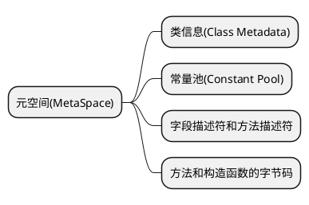
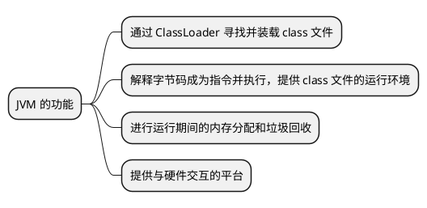
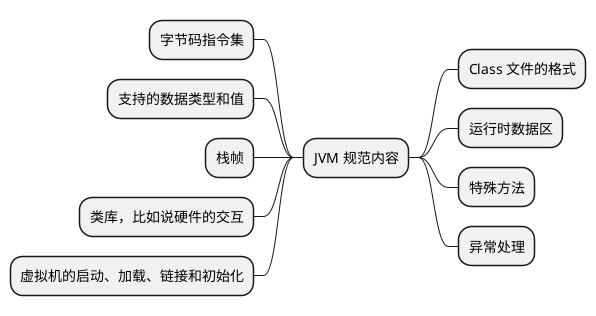

# 从 Hello World 到 JVM

这篇文档介绍了从编写一个 `Hello World` 到 JVM 执行它输出到屏幕，这中间是如何运行的。

## 概述 {id="override"}

首先，我们来编写一个 `Hello World` 的程序:
```Java
public class Main {
    public static void main(String[] args) {
        System.out.println("Hello World");
    }
}
```


在编写了源代码之后，我们将代码编译为字节码:
```Java
javac HelloWorld.java
```

编译后的字节码如下:
```Java
public class icu.hacking.Main {
  public icu.hacking.Main();
    Code:
       0: aload_0
       1: invokespecial #1                  // Method java/lang/Object."<init>":()V
       4: return

  public static void main(java.lang.String[]);
    Code:
       0: getstatic     #7                  // Field java/lang/System.out:Ljava/io/PrintStream;
       3: ldc           #13                 // String Hello World
       5: invokevirtual #15                 // Method java/io/PrintStream.println:(Ljava/lang/String;)V
       8: return
}
```

这个 `Main` 的类的信息在编译为字节码之后，会被存储在 JVM 的元空间中(Java 8 以前存储在 Method Area 中)。这个空间中，包含了如下信息，所有
线程共享:



最后，JVM 执行字节码。执行的方式有两种，一种是解释执行，一种是 JIT（即时编译技术， Just-In-Time Compilation, JIT）。但是，对于这个
`Hello World` 的程序，这一行代码执行的时间极短，所以并不会触发即时编译。故而，是采用解释执行的。主要有如下三步骤:

1. **类加载**: 当执行 java HelloWorld 命令时，JVM 的类加载器（Class Loader）会负责查找并加载名为 HelloWorld 的类。它首先找到对应的
`.class` 文件，将其加载到 JVM 内存的 Method Area 中，将类结构信息（如类名、字段、方法签名和字节码）解析出来。
2. **字节码解释执行**： 加载完成后，JVM 的执行引擎开始运行程序。对于 `main` 方法，它会读取其字节码指令，并逐条解释执行。当执行到 
`System.out.println("Hello, World!");` 这行代码时，解释器会调用 Java 标准库中 `PrintStream` 类的 `println` 方法，该方法最终会将字
符串 "Hello, World!" 输出到控制台。
3. **本地方法接口（JNI）调用**： 在某些情况下（比如涉及 I/O 操作），Java 方法可能需要调用操作系统级别的功能，这时会通过 JNI 调用本地（Native）
方法来完成实际操作。对于 println 方法，虽然内部可能会涉及 JNI 调用，但对这个特定的例子来说，它的实现细节通常是由 JVM 实现提供的，无需用户
显式处理 JNI 调用。

## HotSpot JVM {id="hotspot-jvm"}

JVM 主要提供了如下的功能:



下面这张图展示了 HotSpot JVM 的架构:


从上到下，我们可以看到以下组件：

1. **Class Files**：这些是包含Java类和方法的文件。
2. **Class Loader Subsystem**：这个子系统负责加载类文件到JVM中。它将类文件从磁盘加载到内存，并确保它们在运行时可用。
3. **Runtime Data Areas**：这是JVM在运行时创建的数据区域，包括：
    - **Method Area**：存储类信息、常量、静态变量等。
    - **Heap**：用于存储对象实例和数组。
    - **Java Threads**：JVM支持多线程执行。
    - **Program Counter Registers**：每个线程都有一个程序计数器，用于指示当前正在执行的指令的位置。
    - **Native Internal Threads**：这些是JVM内部的原生线程，用于与操作系统交互。
4. **Execution Engine**：这是JVM的核心部分，负责执行字节码。它包括：
    - **JIT Compiler**：即时编译器将字节码编译成机器代码以提高性能。
    - **Garbage Collector**：垃圾收集器自动管理内存，回收不再使用的对象。
5. **Native Method Interface**：这是JVM与操作系统和其他本地库进行交互的接口。
6. **Native Method Libraries**：这些是JVM依赖的本地库，如操作系统API。

总的来说，HotSpot JVM通过加载类文件、创建运行时数据区域、使用执行引擎来执行字节码并管理内存，从而提供了一个平台无关的环境来运行Java应用程序。

JVM 的更多信息可以参考 [JVM 官方文档](https://docs.oracle.com/javase/specs/jvms/se13/jvms13.pdf), 核心内容如下:



## GraalVM {id="graal-vm"}

我们来看一下 GraalVM 的架构图:


从架构图上看，GraalVM 是基于 HotSpot VM 的，在它的基础上增加了 GraalVM Compiler，同时支持多语言、原生镜像（Native Image)。

此外，我们再来介绍一个同样是 Oracle 开发的 GraalVM，它和 HotSpot VM 的区别如下表所示:

| 对比项      | HotSpot VM                    | GraalVM                                                   |
|----------|-------------------------------|-----------------------------------------------------------|
| 开发者	     | Oracle                        | Oracle                                                    |
| 基于	      | OpenJDK JVM	                  | 延伸自OpenJDK JVM                                            |
| 用途	      | 标准Java应用运行时	                  | 多语言运行时、原生镜像生成等增强功能                                        |
| JIT 编译器	 | C1, C2（客户端/服务器模式）	            | 包括C1和C2，并额外提供Graal编译器                                     |
| 动态编译优化	  | 高效的运行时性能优化	                   | 提供更高级别的编译优化策略                                             |
| AOT编译	   | 不直接支持	                        | 支持Native Image，提前编译成机器码                                   |
| 多语言支持	   | Java, Kotlin, Scala等基于JVM的语言	 | 支持Java及多种其他语言（如JavaScript, Python, Ruby, R, LLVM bitcode） |
| 子项目与扩展	  |                               | Truffle语言实现框架、Polyglot多语言交互                               |
| 原生库兼容性	  | 依赖标准JDK库	                     | 可以通过Substrate VM技术去除未使用的JDK部分，减少体积                        |


## 总结 {id="summary"}

本文介绍了一个 `Hello World` 的 Java 程序的执行流程，并且介绍了 HotSpot JVM 的架构以及核心功能。此外，还介绍了 GraalVM 的架构，以及它和
 HotSpot VM 的区别。

## 参考资料 {id="reference"}

1. [Java Troubleshooting](http://ksoong.org/troubleshooting/)
2. [JVM 官方文档](https://docs.oracle.com/javase/specs/jvms/se13/jvms13.pdf)