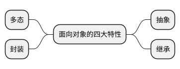

# 面向对象的特性

这篇文档描述了面向对象的四大特性，分别是抽象、继承、多态以及封装。


```plantuml
@startmindmap
+ 面向对象的四大特性
++ 抽象
++ 继承
-- 多态
-- 封装
@endmindmap
```

## 多态

多态有两种实现方式，通过继承或者接口实现。
```Java
// 通过继承
Animal animal = new Dog();
// 通过接口
IEngine engine = new CarEngine()
```