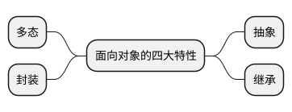

# 面向对象的特性

这篇文档描述了面向对象的四大特性，分别是抽象、继承、多态以及封装。



## 封装

封装也叫做数据隐藏或者数据访问保护，从程序上来说就是隐藏程序的属性、实现细节，对外提供接口以供调用。那么封装的本质是什么呢？比如说类封装的是数据和行为，前端的组件封装了 HTML、CSS、Javascript。

* **封装不是面向对象提出的概念**：比如在 C 语言中的函数，也是对行为一种封装。而结构体也可以是对数据和行为的封装。所以，不是说用 C 写出来的代码就一定是面向过程的，用 Java 写出来的代码就一定是面向对象的。
* **封装是有层次的、是有粒度的**: 比如 MVC（Model-View-Controller）就是一种分层的封装。不同层次之间的封装粒度不同，通常底层的封装粒度较细、高层的封装粒度更粗。
* **封装为了实现隔离**: 将功能封装成类或者组件，其实也是实现了类（组件、模块、服务、系统）之间的隔离，实现高内聚、低耦合，实现系统架构的可扩展性和灵活性。

## 多态

多态有两种实现方式，通过继承或者接口实现。
```Java
// 通过继承
Animal animal = new Dog();
// 通过接口
IEngine engine = new CarEngine()
```