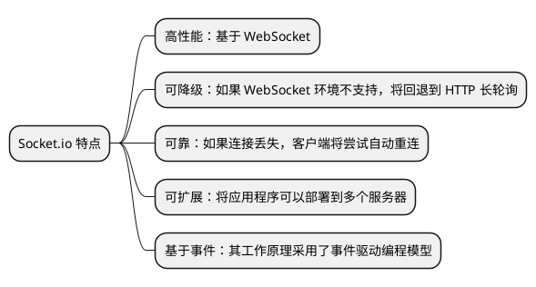
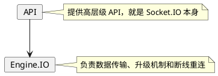
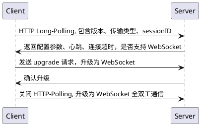

# 构建 Socket.io 应用

这篇文档描述了如何在 SpringBoot 中接入 Socket.io, 构建基于 WebSocket 的应用。

## 什么是 Socket.io {id="what"}

Socket.io 最初是一个基于 JavaScript 的库，用于 Node.js 服务器和 JavaScript 客户端之间实现实时、双向和基于事件的通信。

但是随着时间的推移，目前是一个跨平台的实时通信的解决方案，提供多种语言的支持。其核心特点:



## Socket.io VS Spring WebSocket

`Socket.io` 和 `Spring WebSocket` 都是用于实现实时通信的技术，但它们有一些关键的区别：

| 特性/技术       | Socket.io                                        | Spring Boot WebSocket Starter          |
|-------------|--------------------------------------------------|----------------------------------------|
| **语言/平台**   | JavaScript（主要用于Node.js环境）                        | Java（用于Spring Boot应用）                  |
| **协议支持**    | 支持 WebSocket 和其他如长轮询的传输方式，自动选择最佳传输方式             | 仅支持 WebSocket 协议                       |
| **客户端兼容性**  | 更广泛，可在不支持WebSocket的旧浏览器中回退到其他传输方式                | 依赖于客户端支持WebSocket                      |
| **集成与配置**   | 通常在 Node.js 项目中使用，与其他JavaScript框架（如Express.js）集成 | 与Spring Boot应用无缝集成，支持Spring的配置和依赖注入    |
| **扩展性**     | 内置对多节点和负载均衡的支持                                   | 可以通过Spring框架的功能扩展，但需要额外配置和管理           |
| **社区和生态系统** | 强大的JavaScript社区支持，适合全栈JavaScript开发               | 强大的Java社区和Spring生态系统支持，适合企业级Java应用     |
| **使用场景**    | 适用于需要快速开发和部署的小型到中型项目，特别是Node.js环境中的实时应用          | 适用于需要稳定、可扩展的企业级应用，特别是在Java/Spring生态系统中 |

**Socket.io**：更加灵活，支持多种传输方式，适用于需要广泛浏览器兼容性和快速开发的项目。**Spring WebSocket**：提供了与 Spring 生态系统深度
集成的 WebSocket 支持，适合在企业级Java应用中使用，特别是在需要 Spring 框架的特性和依赖管理时。

## 工作原理 {id="how-it-works"}

Socket.io 从代码实现上分为两层, 通过 API 层调用 Engine.IO:



接下来，我们来说一下 Socket.IO 的握手和升级机制:


如果遇到连接断开，服务端可能的原因如下表所示：

| Reason                        | Description                          |
|-------------------------------|--------------------------------------|
| `server namespace disconnect` | socket 被 `socket.disconnect` 强行断开    |
| `client namespace disconnect` | 客户端使用`socket.disconnect()`手动断开socket |
| `server shutting down`        | 服务器正在关闭                              |
| `ping timeout`                | 客户端在延迟中没有发送 PONG 数据包                 |
| `transport close`             | 连接已关闭（例如：用户失去连接，或网络从 WiFi 更改为 4G）    |
| `transport error`             | 连接遇到错误                               |

客户端的原因如下表所示:

| Reason                 | Description                                      |
|------------------------|--------------------------------------------------|
| `io server disconnect` | 服务器已使用`socket.disconnect()` 强制断开 socket          |
| `io client disconnect` | 使用 `socket.disconnect()` 手动断开 socket             |
| `ping timeout`         | 服务器未在该 `pingInterval` + `pingTimeout` 范围内发送 PING |
| `transport close`      | 连接已关闭（例如：用户失去连接，或网络从 WiFi 更改为 4G）                |
| `transport error`      | 连接遇到错误（例如：服务器在 HTTP 长轮询周期中被杀死）                   |                  

## 安装依赖 {id="dependence"}

下面使用 Maven 来管理项目依赖，在开始之前需要先配置 `pom.xml`, 引入 Socket.IO 的服务端依赖，这是基于 Netty 编写的:
```xml
<dependency>
    <groupId>com.corundumstudio.socketio</groupId>
    <artifactId>netty-socketio</artifactId>
    <version>2.0.3</version>
</dependency>
```

## 配置并启动服务 {id="configure-and-start-server"}

首先，在项目中创建 `SocketIOServerConfig` 类，并编写代码如下:
```Java
@org.springframework.context.annotation.Configuration
public class SocketIOServerConfig {

    @Bean
    public SocketIOServer socketIOServer() {
        Configuration configuration = new Configuration();
        configuration.setHostname("localhost");
        configuration.setPort(9092);

        SocketConfig socketConfig = new SocketConfig();
        socketConfig.setReuseAddress(true);
        configuration.setSocketConfig(socketConfig);

        return new SocketIOServer(configuration);
    }
}
```
上述代码创建了一个在 localhost 上，端口为 9092 的 Socket.IO 服务器。服务一旦启动，即可接收和发送 Socket.IO 事件。

比如我要编写一个 Echo 的服务，即服务端返回的客户端发送的文本内容。创建一个名为 `SocketIOServerInitializer` 的类，代码如下：
```Java
@Component
@AllArgsConstructor
public class SocketIOServerInitializer implements ApplicationListener<ContextRefreshedEvent> {

    private final SocketIOServer server;

    @Override
    public void onApplicationEvent(ContextRefreshedEvent event) {
        server.addConnectListener(client -> System.out.println("New Client connected: " + client.getSessionId()));
        server.addEventListener("echo", String.class, (client, data, ackRequest) -> client.sendEvent("echo", data));
        server.addDisconnectListener(client -> System.out.println("Client disconnected: " + client.getSessionId()));
        server.start();
    }
}
```
然后启动服务，可以使用 Postman 请求这个服务:


## 封装 addEventListener {id="addEventListener"}

上面的代码中，我们通过 `server.addEventListener()` 方法注册了事件观察者。但是，在实际项目中，我们可能会注册非常多的事件的观察者。如果我们
每添加一个 Listener 就需要修改 `onApplicationEvent` 这样底层的代码，非常不方便也不安全。所以，对此我们应该进一步的封装。

在 SpringBoot 中，我们可以通过对 `Controller` 类添加类似 `@RestController` 以及 `@GetMapping` 这样的注解来注册控制器和方法。我们可以
参照这种做法，封装我们的 `EventListener`。

首先，我们需要创建一个注解，名为 `@SocketIOListener`, 用来标注 `Listener` 的类:
```Java
@Target({ElementType.TYPE})
@Retention(RetentionPolicy.RUNTIME)
@Documented
@Service
public @interface SocketIOListener {
}
```

接着，我们需要创建另一个注解，名为 `@SocketIOEventMapping`，用来标注 `Listener` 类中的公开的方法:
```Java
@Retention(RetentionPolicy.RUNTIME)
@Target(ElementType.METHOD)
public @interface SocketIOEventMapping {
    String event();
}
```

有了注解之后，我们可以在 `SocketIOServerInitializer` 类中，添加一个私有方法 `addEventListeners`，扫描注解，自动注册 `Listener`:
```Java
private void addEventListeners() {
    final Map<String, Object> beans = applicationContext.getBeansWithAnnotation(SocketIOListener.class);
    for (final Object bean : beans.values()) {
        Method[] methods = bean.getClass().getMethods();
        for (Method method : methods) {
            SocketIOEventMapping annotation = method.getAnnotation(SocketIOEventMapping.class);
            if (annotation != null) {
                String eventName = annotation.event();
                server.addEventListener(eventName, String.class, (client, data, ackSender) -> method.invoke(bean, data));
            }
        }
    }
}
```
最后，我们只要编写类似 `UserListener` 这样的类处理业务即可，屏蔽了 Socket.IO 中 `EventListener` 相关的底层细节:
```Java
@SocketIOListener
public class UserEventListener {

    @SocketIOEventMapping(event = "login")
    public void handleLogin(String data) {
        System.out.println("data = " + data);
    }

}
```

## 使用 Protobuf {id="protobuf"}

为了支持 Protobuf 序列化协议，我们需要对上面的代码进行一些小的改造。比如，我现在有一个 `UserLoginEvent.proto` 的文件:
```
syntax = "proto3";

message UserLoginRequest {
    string username = 1;
    string password = 2;
}
```
> 我假设读者已经知道如何在 Java 中编写并编译 Proto 文件了。

然后我们上面使用反射添加 EventListener 的方法需要进行改造，动态将客户端传送的二进制反序列化为 `UserLoginRequest` 类，然后传递给 Listener
 方法:
```Java
server.addEventListener(eventName, String.class, (client, data, ackSender) -> {
    Class<?>[] parameterTypes = method.getParameterTypes();
    Class<?> protoClazz = parameterTypes[0];
    Method parseFromMethod = protoClazz.getMethod("parseFrom", byte[].class);
    Object protoBody = parseFromMethod.invoke(null, (Object) binaryStringToByteArray(data));
    method.invoke(bean, protoBody);
});
```
我们获取了 `method` 的第一个参数的类型，可以约定这个类型就是我们的 Protobuf 的参数类。然后通过反射调用其 `parseFrom` 这个静态方法，传入
客户端传过来的字节序列（二进制需要先转换为字节序列），这个方法如下:
```Java
private byte[] binaryStringToByteArray(String s) {
    int count = s.length() / 8;
    byte[] b = new byte[count];
    for (int i = 1; i < count; ++i) {
        String t = s.substring((i - 1) * 8, i * 8);
        b[i - 1] = (byte) Integer.parseInt(t, 2);
    }
    return b;
}
```

