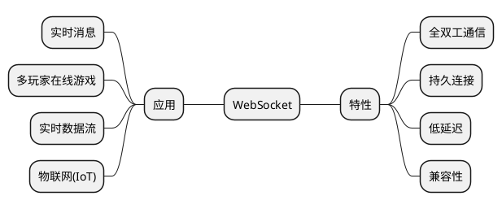
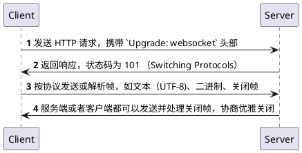
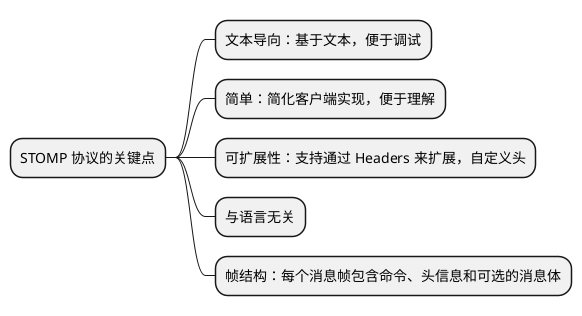
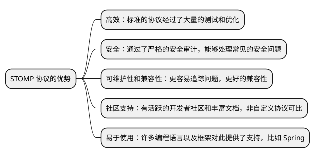
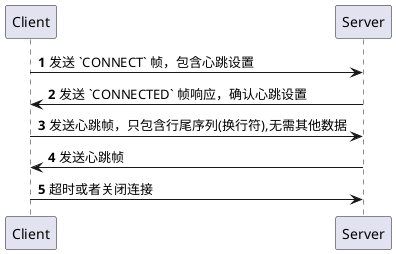
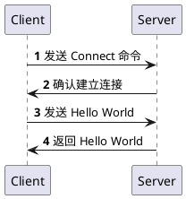

# SpringBoot 构建 WebSocket 程序

这篇文档介绍了如何在 SpringBoot 中构建 WebSocket 程序。这篇文档首先会深入解释 WebSocket 协议相关内容。然后详细介绍其在 SpringBoot 中的应用，
这包括对 STOMP 协议的详解、已经消息的接收、发送、订阅等。

## WebSocket 协议 {id="websocket"}

WebSocket 是一种网络通信协议，提供了在单个 TCP 连接上进行全双工通讯的能力。这种协议于 2011 年作为 RFC 6455 正式标准化，并成为了实现实时网
页应用的重要技术。


因为 WebSocket 协议是基于 HTTP 协议的升级机制，所以其有着非常好的兼容性。浏览器兼容性可以参考 [MDN-WebSockets API](https://developer.mozilla.org/zh-CN/docs/Web/API/WebSockets_API)。

### 工作原理 {id="how-it-works"}

上文已经提到，WebSocket 的实现是依赖于 HTTP 协议的升级机制的。所以，对于理解 WebSocket 来说，理解升级机制是至关重要的。

HTTP 1.1 协议版本 中已经规定了升级机制，**它允许客户端和服务器协商升级到一种不同的协议，比如说 WebSocket 协议、HTTP2 协议**。



WebSocket 协议本身并没有定义心跳机制，但是服务端需要通过实现心跳（发送 ping/pong 帧）来维持和检查连接的活跃状态。

关于 WebSocket 的更多细节，可以参考 [RFC 6455 - The WebSocket Protocol](https://datatracker.ietf.org/doc/html/rfc6455)。

## STOMP 协议 {id="stomp"}

STOMP（Simple (or Streaming) Text Orientated Messaging Protocol）是一种简单的文本导向的消息传递协议。它被设计为提供一个易于实现的消
息传递协议，适用于与其他消息传递中间件（如 ActiveMQ, RabbitMQ 等）的交互。



### 优势和劣势 {id="advantages-and-disadvantages"}

下面分别介绍这个 STOMP 协议的优势和劣势。优势如下:



正如其他协议一样，没有一个协议是完美的。STOMP 也存在一些劣势，比如因为采用文本导向，所以相对于一些二进制协议有更大的处理开销和网络带宽使用。

虽然 STOMP 提供了一种基本的发布/订阅消息模型，但可能无法满足所有状况下的需求。如果你的业务需求不符合 STOMP 提供的模型，你可能会发现在 STOMP
上进行扩展或修改很困难。

STOMP 提供了基本的消息传递功能，如交换机，队列和路由等，但这可能无法满足更为复杂的、需要更多的消息传递模式的应用。

STOMP 作为 WebSocket 协议的子集，它固然拥有 WebSocket 的优点，但也继承了其缺点。例如，对于不支持 WebSocket 的环境，STOMP 可能无法正常工作。

总之，**除非有特殊需求，大部分情况下都应该选择使用标准的协议。这样可以让你专注于业务逻辑的实现，而不必担心底层的协议和通信问题**。

### 基本操作 {id="actions"}

STOMP 和客户端的交互操作如下表所示:

关于 STOMP 协议的基本操作，我们可以将其概括在下表中：

| 操作          | 描述                        |
|-------------|---------------------------|
| CONNECT     | 客户端发送此帧来请求与服务器建立连接。       |
| CONNECTED   | 服务器响应 CONNECT 请求，表示连接已建立。 |
| SEND        | 客户端发送消息到指定的目的地。           |
| SUBSCRIBE   | 客户端发送此帧来订阅特定目的地的消息。       |
| UNSUBSCRIBE | 客户端发送此帧来取消订阅特定目的地的消息。     |
| MESSAGE     | 服务器发送此帧来向客户端传递订阅目的地的消息。   |
| ACK         | 客户端发送此帧来确认已经收到并处理了特定的消息。  |
| NACK        | 客户端发送此帧来表示未能正确处理特定的消息。    |
| DISCONNECT  | 客户端发送此帧来请求关闭与服务器的连接。      |

### 帧的结构 {id="frame"}

STOMP 协议中的帧（Frame）是基本的通信单位，用于在客户端和服务器之间传递消息。每个帧都遵循一定的结构，包括命令、头部（Headers）和消息体（Body）。

比如下面是一个发送普通消息的帧结构:
```text
SEND
destination:/queue/test
content-type:text/plain

hello, world
^@
```

在这个例子中：
- `SEND` 是命令。
- `destination:/queue/test` 和 `content-type:text/plain` 是头部，指定了消息的目的地和内容类型。
- `hello, world` 是消息体，即实际要发送的消息。
- 帧以 `^@` 结束，这里代表空字符（`\0`），表示帧的结束。

下面是一个订阅消息的帧结构的示例:
```text
SUBSCRIBE
id:sub-1234
destination:/topic/news
ack:auto

^@
```

在这个示例中，每个部分代表如下：

* 命令：`SUBSCRIBE` 指示这是一个订阅操作的帧。
* 头部：
    * `id:sub-1234` 是这个订阅的唯一标识符。客户端使用这个 ID 来识别订阅。
    * `destination:/topic/news` 指定了要订阅的目的地。在这个例子中，是一个名为 `/topic/news` 的主题。
    * `ack:auto` 指明了消息确认的模式。在这里，auto 表示消息被自动确认。
* 消息体：在 `SUBSCRIBE` 帧中通常没有消息体。
* 帧结束符：以空字符`（\0）`结束，这里用 `^@` 表示。

### 心跳机制 {id="heartbeat"}

STOMP 协议中规定了心跳机制，用于维持客户端和服务器之间的连接，确保连接处于活动状态，并及时检测到任何潜在的连接问题。


当客户端或者服务器在指定时间内没有收到心跳帧，会触发超时处理，比如尝试重连或者关闭连接。

## Netty VS Spring WebSocket Starter {id="netty-vs-spring-websocket-starter"}

虽然这篇文档介绍的是如何使用 `spring-boot-starter-websocket`，但是也对比一下它与 Netty 之间的差别，如下表所示:


| 对比     | Netty                                                         | Spring WebSocket Starter                                     |
|--------|---------------------------------------------------------------|--------------------------------------------------------------|
| 协议支持   | 支持HTTP和WebSocket协议，并可随时切换。也支持更底层的网络协议。                        | 构建在WebSocket上的STOMP协议，提供了如订阅/广播模式、用户和会话模型等强大的功能。             |
| 性能     | 高性能,在某些内存分配和网络方面的操作中，Netty性能相当优良                              | 取决于Spring WebSocket配置和实际使用的底层框架                              |
| API级别  | 提供了低级别的API，可进行更深入的开发                                          | 基于STOMP协议的高级API,对大部分开发是足够的，Spring的封装使我们能够用声明式编程来处理STOMP消息    |
| 集成与兼容性 | Java生态中能够广泛使用，但对于Spring的集成不如Spring WebSocket Starter那么自动化和顺手。 | 对于Spring 应用来说，可以很好地与Spring其他部分一起工作。对于web应用开发人员来说更友好。         |
| 适用情况   | 适合需要高性能和自定义很多网络细节的情况。                                         | 对于初级阶段的应用或者已经使用了Spring全家桶的项目，使用Spring WebSocket Starter更容易集成 |

所以，基于自己团队是否对 Netty 深入掌握，来决定使用 SpringBoot WebSocket Starter 或者 Netty。当我们的项目确实需要深入控制网络底层 API 
的时候，或者当我们对 Netty 更深入了解的时候，才考虑使用 Netty 作为升级选项。

长期以来，Spring 框架已经通过提供稳定的抽象以简化企业级 Java 开发证明了其价值。使用 Spring Boot WebSocket Starter 会让你的开发过程更加
直观和简洁，它良好的集成性和扩展性可以满足大多数应用场景的需求。

同时，向更底层的网络框架如 Netty 转型，是一个需要深思熟虑的决定。在团队了解其与应用的兼容性，以及如何用它来优化网络性能之后，才进行转换是明智的。

这样的决策，也体现了渐进式架构思想，为了画出完整的路线图。先用 Spring Boot WebSocket Starter 进行开发，当对于网络底层有了更深的理解，再考
虑使用 Netty 进行优化，这将有助于你的项目逐步深入和扩展。

## 引入依赖 {id="dependence"}

`spring-boot-starter-websocket` 是一个 Spring Boot Starter，用于简化 Spring Boot 应用程序中 WebSocket 的使用。通过添加 
`spring-boot-starter-websocket` 依赖，Spring Boot会自动配置基于 STOMP 的 WebSocket 消息，并整合了 SockJS 等其他工具。

```xml
<dependency>
    <groupId>org.springframework.boot</groupId>
    <artifactId>spring-boot-starter-websocket</artifactId>
</dependency>
```

## Spring Boot WebSocket Starter 工作原理 {id="how-spring-boot-websocket-starter-works"}

Spring Boot WebSocket Starter 是建立在 Spring WebSocket 基础之上的，用于简化 Spring Boot 中 WebSocket 的配置和使用。它提供了一些
自动配置和类库，以便你在应用程序中使用 WebSocket 和 STOMP。

当你的 Spring Boot 项目中添加了 Spring Boot WebSocket Starter 依赖后，Spring Boot 会自动完成以下操作：

* **自动装配** ：Spring Boot 在启动时会自动检测 classpath 下的库并进行配置。如果检测到 Spring WebSocket，那么 Spring Boot 就会启动 
WebSocket 服务。相应的，如果检测到 STOMP，就启动 STOMP 服务。

* **WebSocketHandler 和 STOMP 的控制器** ：Spring Boot 会自动创建并注册下列的 Bean： 

  * STOMP 协议的请求控制器，对应 Spring 中的 `@Controller` 类，这些类可以用来处理 STOMP message。

  * WebSocketHandler：用于处理 WebSocket 的消息，提供更低级别的操作。

* **MessageBroker** ：Spring Boot 会自动配置一个 Message broker，用于管理消息的发布和订阅。默认的 broker 是一个简单的内存 broker，
但你可以非常容易地切换到其他例如 RabbitMQ、ActiveMQ 之类的完整特性的 broker。

* **SockJS 支持** ：如果添加了 SockJS 的依赖，Spring Boot 也可以自动启用 SockJS，使你的 WebSocket 应用在那些不支持 WebSocket 的环境
中也可以正常工作。

以上就是 Spring Boot WebSocket Starter 的大致工作原理。常见的难点，例如 handler 的注册、SockJS 的配置，Message broker 的设置等等，Spring Boot 都帮你自动完成了。而开发者只需要专注于编写基于 STOMP 的控制器，处理业务逻辑即可。

## 案例1: Echo Server {id="echo"}

纸上得来总觉浅，绝知此事要躬行。前面已经说了一堆理论，应该要动手了。在这一章节，我们需要完成一个 Echo 的服务。客户端发送什么，服务端就原样返回。



### 编写配置注册端点 {id="configure-endpoint"}

首先，我们需要编写配置，启用 `WebSocket`，并且在配置中注册端点（Endpoint）。编写配置类 `WebSocketConfig` 如下:
```Java
@Configuration
@EnableWebSocket
@AllArgsConstructor
public class WebSocketConfig implements WebSocketConfigurer {

    private final EchoHandler echotHandler;

    @Override
    public void registerWebSocketHandlers(WebSocketHandlerRegistry registry) {
        registry.addHandler(echoHandler, "/");
    }
}
```
如你所见，这个配置类实现了 `WebSocketConfigurer` 接口。这个接口定义了一个方法， `registerWebSocketHandlers()`。Spring Boot 在启动的
时候会调用这个方法，你可以在这个方法中将你的 `WebSocket handler` 注册到你想要处理 WebSocket 连接的端点上。

在我的上述例子中，所有连接到 `/` 的 WebSocket 连接都会调用 `defaultHandler` Bean 中的方法。

> 端点（Endpoint）: 指的是一个 WebSocket 服务被打开的一端的地址。例如，如果你有一个 WebSocket 服务的地址是 `ws://mywebsite.com/liveupdates`，
> 那么这个 URL 就被称为一个 WebSocket Endpoint。不同的端点，是不可以复用连接的。比如游戏中，所有的玩家都连接一个端点。

既然理解了什么是端点，并且在上面的代码中，我们已经为端点配置了 `EchoHandler`。 在 Spring WebSocket 中，`WebSocketHandler` 接口负责处理
WebSocket 消息。为了创建你自己的处理器，你可以实现这个接口，或者直接继承 `TextWebSocketHandler` 或 `BinaryWebSocketHandler` 这样的父
类（它们本身已经实现了 `WebSocketHandler` 结构）。

```Java
@Component
public class DefaultHandler extends TextWebSocketHandler {

    @Override
    protected void handleTextMessage(WebSocketSession session, TextMessage message) throws Exception {
        session.sendMessage(new TextMessage("Echo:" + message.getPayload()));
    }
}
```

> 你是否会有疑问：STOMP 协议是文本导向的，为什么还提供了 `BinaryWebSocketHandler` ？STOMP 协议是基于文本的。然而，WebSocket 协议自身支
> 持发送二进制数据。如果你打算使用 STOMP，你可能不需要 `BinaryWebSocketHandler`。在使用 STOMP 的情况下，你更可能会使用 
> `TextWebSocketHandler`。然而，如果你要处理二进制数据，或者你在不使用 STOMP 的情况下使用 WebSocket，那么 `BinaryWebSocketHandler`
> 可能会派上用场。

### 测试 Echo Server {id="test-echo-sever"}

最简单的方式，我们可以启动 Postman 发送 WebSocket 的消息。但是我们的 Echo Server 是基于 STOMP 协议的，所以消息帧需要按照 STOMP 协议规定
的帧格式来编写。

例如我们需要发送一个 `CONNECT` 的消息帧:
```text
CONNECT
accept-version:1.1,1.0
heart-beat:10000,10000

^@
```

如下图所示：


如果是发送消息，帧格式如下:
```text
SEND
destination:/app/hello
content-type:text/plain

Hello World^@
```

如果是断开连接，帧格式如下:
```text
DISCONNECT

^@
```
> 需要注意的是，虽然发送 `DISCONNECT` 帧是一个好的做法，但真正终止 WebSocket 连接的是底层 TCP 连接的断开，这通常是由 WebSocket 客户端库
> 负责的。如果你直接关闭了 WebSocket 连接，而没有发送 `DISCONNECT` 帧，STOMP 服务器也应该能正确地处理这种情况。