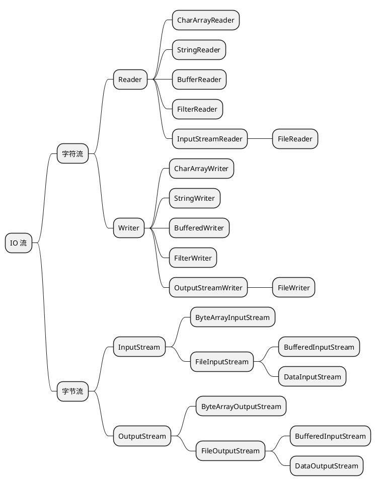

# 字节流和字符流

本文简要介绍了Java中的IO流操作，包括输入流和输出流，以及字符流和字节流的概念。Java提供了处理字符流的类，如`Reader`和 `Writer`，简化了字符处理的
操作。此外，还介绍了Reader类的扩展，包括`BufferedReader`、`FilterReader和InputStreamReader`，以及文件读写流的概念。

## IO流

编程说到底就是在处理各种类型的数据，这些数据有些是来自内存、有些是来自文件、有些是来自网络（也就是其他计算机上的某个进程）。输入的叫做输入流（
InputStream），输出的叫做输出流（OutputStream）。对数据输入输出的接口，封装在 `java.io` 这个包中。

从整体上来看看这个包中都包含什么:

字符就是我们看到的 `a`、`b`、`c`、`1`，也就是 Java 中的 `char` 类型。而字节更为原始，一个字节等于 8 个 bit。

## 字符流

## 字节流

## 装饰器模式

## 总结