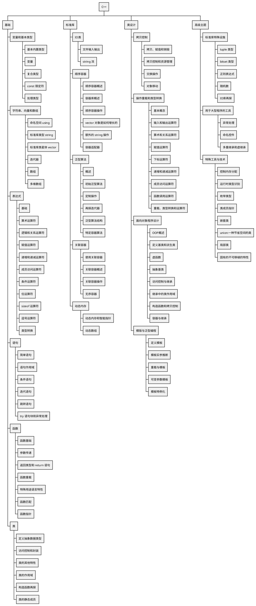

# C++基础

```plantuml
@startwbs
* C++
** 基础
*** 变量和基本类型
**** 基本内置类型
**** 变量
**** 复合类型
**** const 限定符
**** 处理类型
*** 字符串、向量和数组
**** 命名空间 using
**** 标准库类型 string
**** 标准库类星体 vector
**** 迭代器
**** 数组
**** 多维数组
*** 表达式
**** 基础
**** 算术运算符
**** 逻辑和关系运算符
**** 赋值运算符
**** 递增和递减运算符
**** 成员访问运算符
**** 条件运算符
**** 位运算符
**** sizeof 运算符
**** 逗号运算符
**** 类型转换
*** 语句
**** 简单语句
**** 语句作用域
**** 条件语句
**** 迭代语句
**** 跳转语句
**** try 语句块和异常处理
*** 函数
**** 函数基础
**** 参数传递
**** 返回类型和 return 语句
**** 函数重载
**** 特殊用途语言特性
**** 函数匹配
**** 函数指针
*** 类
**** 定义抽象数据类型
**** 访问控制和封装
**** 类的其他特性
**** 类的作用域
**** 构造函数再探
**** 类的静态成员 
** 标准库
*** IO类
**** 文件输入输出
**** string 流
*** 顺序容器
**** 顺序容器概述
**** 容器库概述
**** 顺序容器操作
**** vector 对象是如何增长的
**** 额外的 string 操作
**** 容器适配器
*** 泛型算法
**** 概述
**** 初始泛型算法
**** 定制操作
**** 再探迭代器
**** 泛型算法结构
**** 特定容器算法
*** 关联容器
**** 使用关联容器
**** 关联容器概述
**** 关联容器操作
**** 无序容器
*** 动态内存
**** 动态内存和智能指针
**** 动态数组
** 类设计
*** 拷贝控制
**** 拷贝、赋值和销毁
**** 拷贝控制和资源管理
**** 交换操作
**** 对象移动
*** 操作重载和类型转换
**** 基本概念
**** 输入和输出运算符
**** 算术和关系运算符
**** 赋值运算符
**** 下标运算符
**** 递增和递减运算符
**** 成员访问运算符
**** 函数调用运算符
**** 重载、类型转换和运算符
*** 面向对象程序设计
**** OOP概述
**** 定义基类和派生类
**** 虚函数
**** 抽象基类
**** 访问控制与继承
**** 继承中的类作用域
**** 构造函数和拷贝控制
**** 容器与继承
*** 模版与泛型编程
**** 定义模板
**** 模板实参推断
**** 重载与模板
**** 可变参数模板
**** 模板特例化
** 高级主题
*** 标准库特殊设施
**** tuple 类型
**** bitset 类型
**** 正则表达式
**** 随机数
**** IO库再探
*** 用于大型程序的工具
**** 异常处理
**** 命名控件
**** 多重继承和虚继承
*** 特殊工具与技术
**** 控制内存分配
**** 运行时类型识别
**** 枚举类型
**** 类成员指针
**** 嵌套类
**** union:一种节省空间的类
**** 局部类
**** 固有的不可移植的特性
@endwbs
```