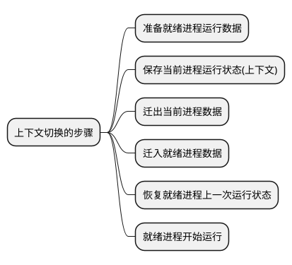

# 进程和线程上下文切换

通过这篇文章来了解进程和线程的上下文切换，什么是上下文切换？上下文切换的成本如何计算？

## 什么是上下文切换 {id="what"}

因为现代的操作系统都属于分时操作系统，通过赋予每个进程固定的 CPU 时间片来达到多个程序轮流运行的能力。而不是让单个程序 运行完后，再运行第二个程序。

所以，当时间片到或者出现阻塞的时候，需要随时将运行到一半的程序保存起来，切换到下一个程序继续运行。那么这些提供给进程下一次运行所需要保存起来的数据，就称之为进程的上下文。

进程的上下文包含了寄存器级别的上下文以及用户级的上下文(存储在主存中的数据)。

上下文切换的步骤如下:

## 下文切换的成本 {id="cost-time"}

统计 Linux 中的上下文切换次数,使用 `sar -w 1 10` 这样的命令, 例如，每次上下文切换的成本在 2us ~ 5us 左右，在满载的情况下，
每秒上下文切换的成本高达 25ms。

进程切换，需要将内存以及高速缓存中的数据全部切换。而线程切换则只需要切换高速缓存中的一部分内容即可。所以进程切换的成本远高于线程切换的成本。