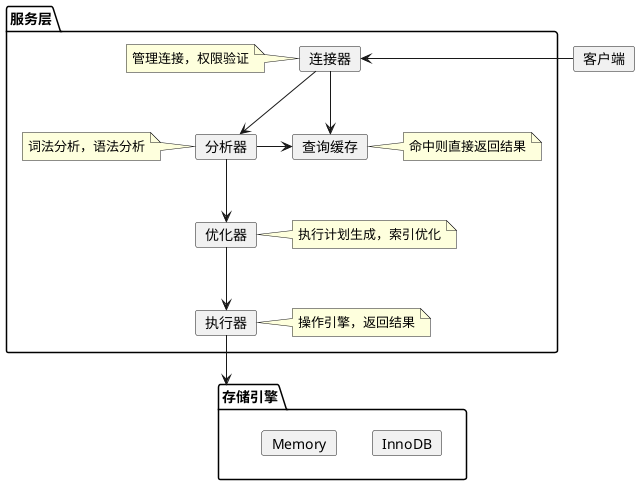

# 基础知识 

MySQL 是一个应用非常广的关系型数据库, 目前最新的是 v8.x 版本。掌握 MySQL 对于开发人员来说是一门基本功，故而不可不重视。

## MySQL 的基本架构 {id="architecture"}

这张图展示了MySQL的基本架构和查询执行流程，包括以下步骤：

1. **连接处理和安全性**：
    - 当客户端连接到MySQL服务器时，首先进行连接处理，包括身份验证和权限验证。

2. **查询解析和优化**：
    - **SQL解析器**：接收到SQL查询后，解析器将SQL文本转换成一种结构化的形式。
    - **预处理器**：检查SQL语句的语法是否正确，确认所有涉及的表和列都存在，并应用权限规则。
    - **查询优化器**：优化器会评估多个可能的查询执行计划，并选择一个成本最低的计划来执行查询。

3. **查询执行**：
    - 根据优化器选择的执行计划，查询执行引擎执行查询，并从存储引擎中检索或更新数据。

4. **存储引擎**：
    - 存储引擎负责MySQL中数据的存储和提取。最常见的存储引擎是InnoDB，它支持事务处理、行级锁定和外键。
    - `Memory`存储引擎，它将数据存储在内存中，适用于临时表等快速访问的场景。

5. **返回结果**：
    - 执行完查询后，结果会被返回给客户端。

这个流程概括了客户端发送查询到MySQL服务器，经过解析、优化和执行，最后返回查询结果的整个过程。不同的存储引擎可能会以不同的方式处理数据，但上述流程大致适用于所有的存储引擎。

## MySQL8 移除查询缓存 {id="remove-query-cache"}

是的，从MySQL 8.0开始，查询缓存（Query Cache）功能被移除了。在此之前的版本中，MySQL提供了一个查询缓存，它可以缓存SELECT查询的结果集及其对应的查询语句。当相同的查询再次出现时，系统可以直接从缓存中返回结果，而不需要重新执行查询。

然而，查询缓存在现代数据库系统中面临了多个问题，尤其是在高并发的场景下：

1. **缓存失效问题**：即使是表中非常小的更改，也会导致所有涉及该表的缓存结果失效。在高更新环境中，这会导致缓存命中率非常低。

2. **锁竞争**：查询缓存需要在更新数据时管理缓存的失效，这会导致锁竞争问题，特别是在多核处理器上。

3. **额外的复杂性和开销**：维护查询缓存本身需要额外的资源，包括内存和处理时间，特别是在缓存失效频繁发生的情况下。

鉴于这些问题，MySQL 8.0决定完全移除查询缓存功能。这意味着性能优化更加依赖于数据库的设计、索引优化、查询优化以及服务器硬件配置等因素。此外，应用层的缓存（如Memcached或Redis）被推荐用于缓存数据库查询结果，因为这些缓存可以更灵活地控制何时和如何缓存数据，且更适合高并发环境。