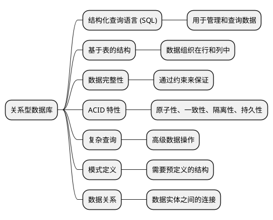
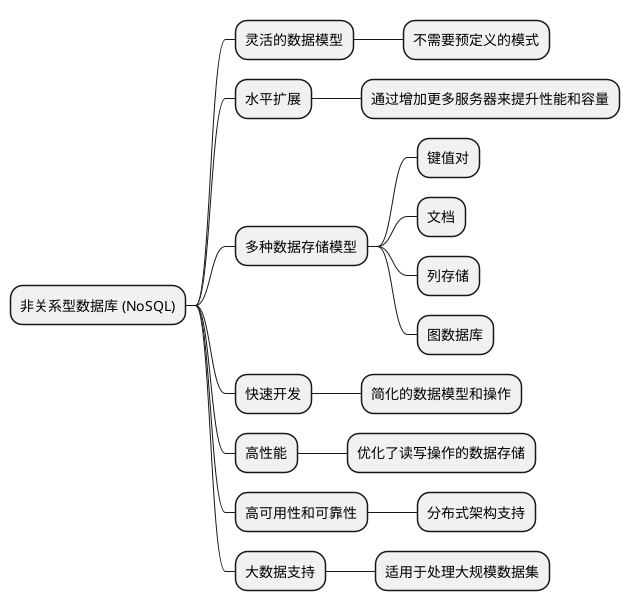

# 数据库的技术选型 

在一个项目正式进入开发之前，技术选型是一项非常重要的前期工作。选择适合项目特点的技术，对于项目的发展来说至关重要。我们需要结合项目特点和技术特点来综合、全面的考量。另外，这样的问题，在面试过程中也经常被问到。

这一篇文档来描述在数据库的开发前，如何进行技术选型。


## 数据库的选型原则

- 数据库是否被广泛的使用
- 数据库的可扩展性
- 数据库的安全性和稳定性
- 数据库所支持是否支持所使用的操作系统版本
- 数据库的使用成本，是否免费，以及是否容易找到熟悉该项技术的开发人员

## SQL 和 NoSQL

从对数据的操作方式来看，市场上主流的有 SQL 和 NoSQL 两类。

使用 SQL 的数据库系统有 MySQL、Oracle、SQLServer、PostGreSQL 等，这些数据库通常都是一些关系型数据库。

使用 NoSQL 的数据库系统有 HBase、MongoDB、Redis、Hadoop 等。NoSQL 的意思是 No Only SQL，即不仅仅有 SQL，但是这类系统大多数都是非关系型数据库。

近年来，NoSQL 数据库大行其道，甚至有说法是 NoSQL 最终会替代 SQL，成为项目中数据存储的主力。实际上，每一种数据库系统都有其适合的应用场景，并不存在一种数据库系统可以解决项目中出现的任何问题。至少当前，SQL 类的数据库系统仍然占据了绝大多数的项目中的应用领域。

下表总结了 SQL 和 NoSQL 数据库之间的主要区别：

| 特征    | SQL (结构化查询语言)                    | NoSQL (非结构化查询语言)               |
|-------|----------------------------------|--------------------------------|
| 数据模型  | 关系型数据库，数据以表格形式存储。                | 非关系型数据库，包括文档、键值对、宽列存储或图形数据库。   |
| 架构    | 表结构固定，需预先定义模式。                   | 模式自由，数据结构可以动态修改。               |
| 可扩展性  | 垂直扩展（增加单个服务器的资源）                 | 水平扩展（增加更多服务器实例）                |
| 事务支持  | 强大的事务支持，ACID（原子性、一致性、隔离性、持久性）保证。 | 有限的事务支持，某些类型的NoSQL数据库支持ACID事务。 |
| 一致性模型 | 强一致性                             | 最终一致性，依赖于具体的数据库类型。             |
| 查询语言  | 有标准的查询语言（SQL）                    | 没有统一的查询语言，查询方式依赖于具体的数据库类型。     |
| 用例    | 适合复杂查询、多表连接和事务管理的场景。             | 适合大规模数据存储、灵活的数据模型和快速迭代的场景。     |
| 索引    | 广泛支持复杂的索引类型。                     | 索引类型和支持程度取决于数据库类型。             |
| 最佳用途  | 金融服务、ERP和CRM系统等事务性强的应用。          | 大数据应用、实时分析、内容管理和IoT等。          |

这个表格概括了 SQL 和 NoSQL 数据库的关键区别，有助于理解它们各自的优势和适用场景。选择哪种类型的数据库，取决于具体的项目需求、数据结构以及预期的扩展方式。

## 关系型数据库和非关系型数据库

我们先来了解一下关系型数据库和非关系型数据库的一些特点。关系型数据库如下:


非关系型数据库的特点:



### 关系型数据库

**关系型数据库的第一个特点是，数据结构话存储在二维表中**。

即我们需要先行定义好数据库表结构，包含列的相关信息。如下表所示：

| 姓名 | 性别 | 生日         | 注册时间       |
|----|----|------------|------------|
| 张三 | 男  | 1980-01-28 | 2018-12-12 |
| 李四 | 男  | 1991-02-03 | 2018-11-21 |
| 小红 | 女  | 1994-07-04 | 2017-10-23 |


但是，目前很多关系型数据库也都开始支持一些非结构化的数据，例如 JSON 格式。

**关系型数据库的第二个特点是，支持事物的原子性(A)、一致性(C)、隔离型(I)、持久性(D)**。

这样的特性可以保证数据的完整性，可以保证一个事务中的 SQL 全部执行或全部不执行，不会出现数据的丢失或混乱的情况。

**关系型数据库都是支持使用 SQL 语言对存储在其中的数据进行操作的**。

SQL 语言支持对存储在不同的实体中的数据进行关联查询，这是很多非关系型数据库很难做到的。

综上所述，关系型数据库的应用场景如下:

- 数据之间存在一定关系，需要关联查询数据的场景
- 需要事务支持的业务场景
- 需要使用 SQL 语言灵活操作数据的场景

### 非关系型数据库

我们来了解一下非关系型数据库的一些特点。

**存储结构灵活，没有固定的结构**，下图中是一个 JSON 格式的数据:

```json
{
    "name": "John",
    "country": "United States",
    "phone": "+0123456789",
    "addresss": {
        "street_addresss": "xxx",
        "city": "xxx",
        "state": "xxx"
    }
}
```


每一行数据都可以拥有不同的列，这相比关系型数据库而言更为灵活。但是这样也带来了一些问题，**存储空间会比关系型数据库占用更大**。

另外，由于非关系型数据库并不完全支持事务特性，在查询或新增数据库的时候，也不需要对数据的完整性进行检查，所以**读写效率比关系型数据库高**。

大多数非关系型数据库都不是使用 SQL 来操作数据的，比如 MongoDB 是使用 JavaScript 来操作数据的。

综上所述，非关系型数据库适合如何场景:

- 数据结构不固定的场景，例如存储商品属性
- 对事物要求不高，但读写兵法比较大的场景，例如日志类应用和行为分析类应用。
- 对数据的处理操作比较简单的场景。

## MySQL8 的一些更新

MySQL 8.0 的推出代表了 MySQL 数据库系统在性能、可靠性、安全性和易用性方面的重大进步。它不仅引入了新的存储引擎，改进了索引机制，还添加了许多新功能，如窗口函数、公共表表达式（CTE）以及更好的JSON支持等。

