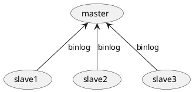

# 主从复制

这篇文档描述了在 MySQL 中的主从复制。


## 主从复制的作用 {id="usecase"}

主从复制主要有如下作用：

* 写操作锁表的情况下，影响读操作，影响业务，主从复制后可以读写分离。
* 作为一种数据备份的方式
* 随着数据增加、IO操作增加，单机会出现瓶颈，大部分项目都是读多写少，所以通过主从复制可以一主多从

## 主从复制原理 {id="why"}


数据在主节点更改，然后会写入到 Binlog 中，从服务器的 IO 线程从主服务器请求指定位置的 Binlog 日志，然后写入到 Relay log (中继日志）中，
然后 SQL 线程不断地从 Relay log 读取数据并写入 Slave 数据库。

## 主从复制配置 {id="configure"}

下面演示两台 MySQL 服务器配置主从复制，拓扑为一主一从。MySQL 的部署就不在此叙述了，在开始之前，需要确定一下 MySQL 的 binlog日志是否开启:
```SQL
> show variables like 'log_bin';
+---------------+-------+
| Variable_name | Value |
+---------------+-------+
| log_bin       | ON    |
+---------------+-------+
```

然后要确定两个服务的 server_id 是不同的，如下:
```SQL
> show variables like 'server_id';
+---------------+-------+
| Variable_name | Value |
+---------------+-------+
| server_id     | 2     |
+---------------+-------+
```

然后要确定两个服务的server_uuid是不同的，特别是在虚拟机环境下，复制镜像可能导致这个是相同的:
```SQL

mysql> show variables like 'server_uuid';
+---------------+--------------------------------------+
| Variable_name | Value                                |
+---------------+--------------------------------------+
| server_uuid   | aa47cc67-c1a0-11ed-afd2-00163e0a4567 |
+---------------+--------------------------------------+
```

### Master 创建账户 {id="create-sync-account"}

在 Master 服务上创建一个账号，用来同步 binlog：
```SQL
mysql> create user repl@172.31.246.36 identified by 'your password';
mysql> flush privileges;
```

> 注意： 账号的域这里写的是 172.31.246.36 这是我的内网地址，一般同步也都是在内网中同步的，最好不要写 %。

接着我们为这个账号配置权限:
```SQL
mysql> grant replication slave on *.* to "repl"@"172.31.246.36"
```

> 注意: 这里的权限有 replication和 slave, 不要设置为 all, 权限太大不安全。

创建完了之后，在 Slave 主机上登录一下，看一下是否能正常登录，避免后面出错难以排查:

```SQL
mysql -urepl -h172.31.246.37 -p 'your password'
```

### 查看 binlog 位置 {id="binlog-position"}

然后我们要查看一下 Master 上的 binlog 日志位置，之后 Slave 要从这个位置开始同步。查看方法如下:
```SQL
mysql> CHANGE MASTER TO
	   > MASTER_HOST="172.31.246.37",
     > MASTER_PORT=3306,
     > MASTER_USER="repl",
     > MASTER_PASSWORD="your password",
     > MASTER_LOG_FILE="binlog.000001",
     > MASTER_LOG_POS=157;
```
> 注意: 配置中，只要是字符串就一定要加上引号，只要是数值，就一定不要加上引号，类型严格。

然后我们可以通过下面命令查看 Slave 节点的状态:
```SQL
mysql> show slave status\G;
*************************** 1. row ***************************
Slave_IO_State: 
Master_Host: 172.31.246.37
Master_User: repl
Master_Port: 3306
Connect_Retry: 60
Master_Log_File: binlog.000001
Read_Master_Log_Pos: 157
Relay_Log_File: iZj6ccl36wfwk297i66wbjZ-relay-bin.000001
Relay_Log_Pos: 4
Relay_Master_Log_File: binlog.000001
Slave_IO_Running: No
Slave_SQL_Running: No
```

主要看第 13 行和第 14 行，如果是No, 则表明还没有开始主从复制，执行下面的命令:
```SQL
mysql> start slave;
```

然后再次查看状态:
```SQL
mysql> show slave status\G;
*************************** 1. row ***************************
...省略前面输出...
Slave_IO_Running: Yes
Slave_SQL_Running: Yes
...省略后面输出...
```
如果第 4 行和第 5 行，输出都是 Yes ，则表明已经配置正确，同步中。我们可以在 Master 上创建一个数据库，然后在 Slave 上查看是否同步成功。
