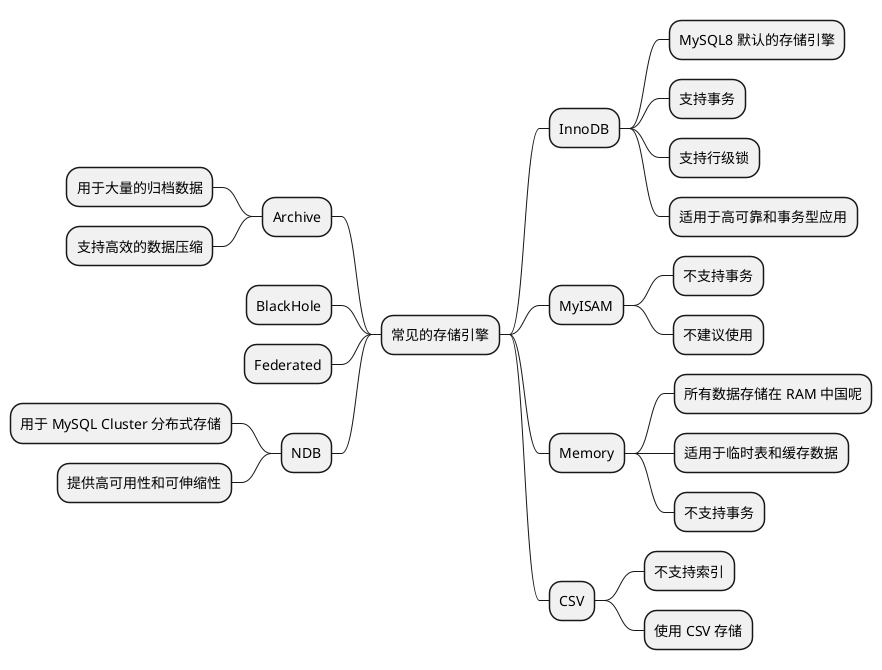

# 存储引擎

接下去，介绍 MySQL 的插件式存储引擎。比较常见的如下:

```plantuml
@startmindmap
+ 常见的存储引擎
++ InnoDB
+++ MySQL8 默认的存储引擎
+++ 支持事务
+++ 支持行级锁
+++ 适用于高可靠和事务型应用
++ MyISAM
+++ 不支持事务
+++ 不建议使用
++ Memory
+++ 所有数据存储在 RAM 中国呢
+++ 适用于临时表和缓存数据
+++ 不支持事务
++ CSV
+++ 不支持索引
+++ 使用 CSV 存储
-- Archive
--- 用于大量的归档数据
--- 支持高效的数据压缩
-- BlackHole
-- Federated
-- NDB
--- 用于 MySQL Cluster 分布式存储
--- 提供高可用性和可伸缩性
@endmindmap
```