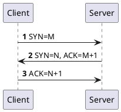
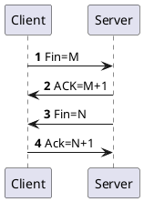

# 三次握手四次挥手

这篇文档将详细描述 TCP 建立连接时经历的三次握手和关闭连接时候的四次挥手。

## 三次握手 {id="3-way-handshake"}

三次握手也好，四次挥手也好，都是用来证明对方有数据包的收发能力:

<table>
    <tr>
        <td></td> 
        <td colspan="4">客户端</td> 
        <td colspan="4">服务端</td> 
    </tr>
    <tr>
        <td></td>
        <td>自己发包</td>
        <td>自己收包</td>
        <td>对方发包</td>
        <td>对方收包</td>
        <td>自己发包</td>
        <td>自己收包</td>
        <td>对方发包</td>
        <td>对方收包</td>
    </tr>
    <tr>
        <td>第一次握手</td>
        <td>N</td>
        <td>N</td>
        <td>N</td>
        <td>N</td>
        <td>N</td>
        <td>Y</td>
        <td>Y</td>
        <td>N</td>
    </tr>
    <tr>
        <td>第二次握手</td>
        <td>Y</td>
        <td>Y</td>
        <td>Y</td>
        <td>Y</td>
        <td>N</td>
        <td>Y</td>
        <td>Y</td>
        <td>N</td>
    </tr>
    <tr>
        <td>第三次握手</td>
        <td>Y</td>
        <td>Y</td>
        <td>Y</td>
        <td>Y</td>
        <td>Y</td>
        <td>Y</td>
        <td>Y</td>
        <td>Y</td>
    </tr>
</table>

## 四次挥手 {id="4-way-handshake"}

为什么需要 4 次挥手呢？因为这是全双工的通信，当 Client 收到服务端的 ACK 之后，就会断开写的通道。这时候，虽然不能向服务端发送消息，但是还可以
接收服务端发送的消息。所以，当服务端发送 Fin 的时候，客户端收到并恢复 ACK=FIN + 1 之后，才完全断开连接。